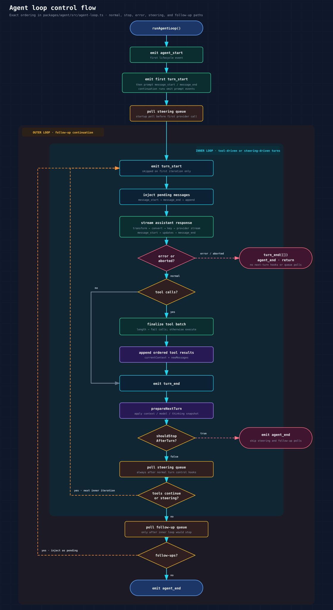
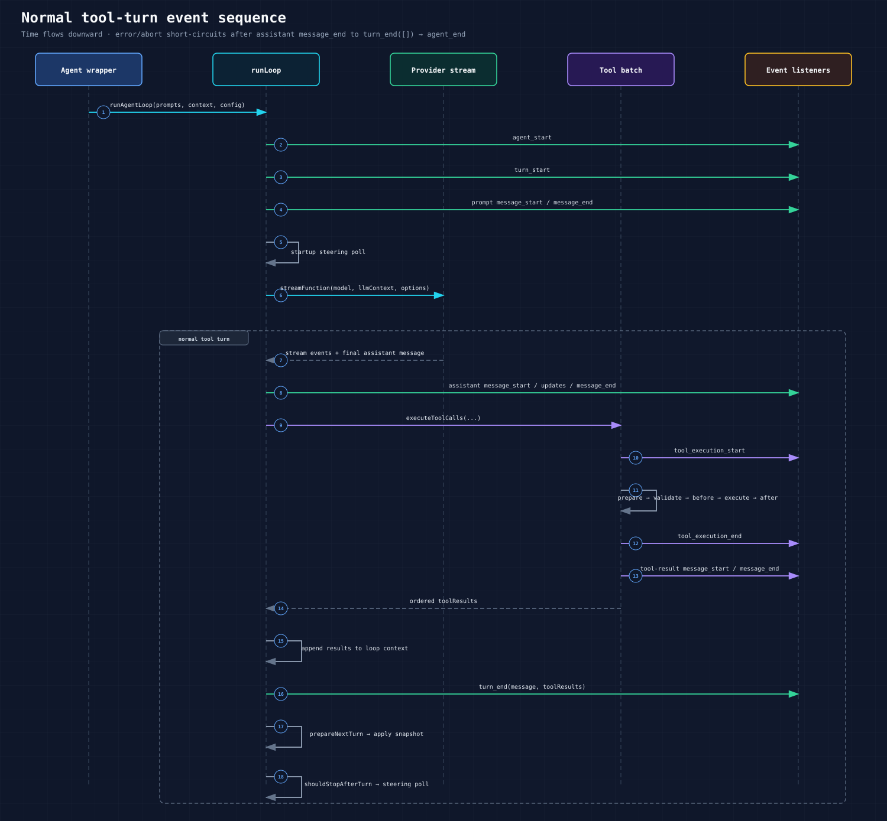
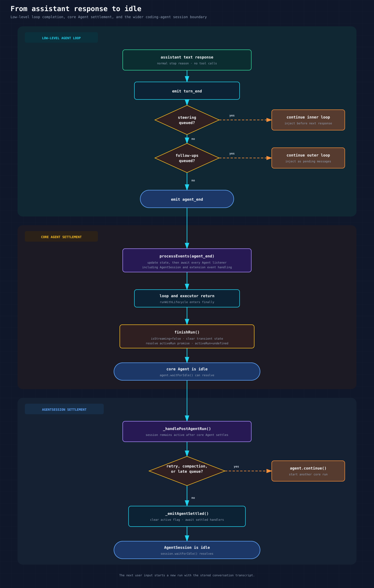

# Agent Loop Queues and Hooks

## Contents

- [Overview](#overview)
- [Loop Shape](#loop-shape)
  - [Run entry](#run-entry)
  - [One inner-loop iteration](#one-inner-loop-iteration)
  - [After the inner loop exits](#after-the-inner-loop-exits)
  - [When an ordinary response ends the run](#when-an-ordinary-response-ends-the-run)
  - [Key loop excerpt](#key-loop-excerpt)
- [Steering vs Follow-Up Queues](#steering-vs-follow-up-queues)
  - [Queue ownership and timing](#queue-ownership-and-timing)
  - [Queue mode semantics](#queue-mode-semantics)
  - [Direct `Agent` configuration](#direct-agent-configuration)
  - [Coding-agent configuration](#coding-agent-configuration)
  - [Low-level loop configuration](#low-level-loop-configuration)
- [`prepareNextTurn`](#preparenextturn)
- [Tool Hooks](#tool-hooks)
  - [`beforeToolCall`](#beforetoolcall)
  - [`afterToolCall`](#aftertoolcall)
- [Tool Execution Order](#tool-execution-order)
- [Context and Provider Hooks](#context-and-provider-hooks)
  - [`transformContext`](#transformcontext)
  - [`convertToLlm`](#converttollm)
  - [`getApiKey`](#getapikey)
  - [`onPayload`, `onResponse`, and provider headers](#onpayload-onresponse-and-provider-headers)
- [Turn Control Hooks](#turn-control-hooks)
- [Active Run Settlement](#active-run-settlement)
  - [Core `Agent` idle boundary](#core-agent-idle-boundary)
  - [`AgentSession` idle boundary](#agentsession-idle-boundary)

## Overview

`packages/agent/src/agent-loop.ts` owns the low-level turn loop. It accepts an `AgentLoopConfig` with callback hooks for context conversion, provider requests, tool interception, queue draining, stop checks, and next-turn state replacement.

`packages/agent/src/agent.ts` is a stateful **wrapper** around that loop. It stores hook fields, owns steering and follow-up queues, builds `AgentLoopConfig`, and tracks active run settlement.

`packages/coding-agent/src/core/agent-session.ts` wires some of those hooks to extension events and adds higher-level session lifecycle behavior. Extension events such as `input` and `before_agent_start` run at the session layer before the low-level agent loop; tool, context, and provider events adapt hooks used during the loop.

## Loop Shape

The earlier ten-step summary was directionally correct but not exact. Steps that happen once per assistant turn were mixed with follow-up polling and final settlement, which happen only after the inner loop exits. The implementation has two nested levels:

```text
outer loop
  continues only when follow-up messages exist after the agent would stop

inner loop
  continues while there are tool calls or steering messages
```



[Open the @2x PNG](diagram/agent-loop-control-flow@2x.png)

### Run entry

`runAgentLoop()` performs this setup before the nested loops:

1. Add the submitted prompt messages to `currentContext` and `newMessages`.
2. Emit `agent_start`.
3. Emit the first `turn_start`.
4. Emit `message_start` and `message_end` for each submitted prompt.
5. Enter `runLoop()`, which polls steering messages once before the first inner-loop iteration.

`runAgentLoopContinue()` has the same event order but does not add or emit prompt messages because they are already present in its context.

### One inner-loop iteration

The exact normal-path order is:

1. Emit `turn_start`, except on the first iteration because run entry already emitted it.
2. Inject pending steering or follow-up messages. Each produces `message_start` and `message_end` before being added to the loop context.
3. Prepare and stream the assistant response:
   1. Run `transformContext`, if configured.
   2. Run `convertToLlm`.
   3. Build the provider `Context`.
   4. Resolve the API key with `getApiKey`, falling back to `config.apiKey`.
   5. Call the stream function and emit assistant `message_start`, zero or more `message_update` events, and `message_end`.
4. If the assistant message has `stopReason: "error"` or `"aborted"`, emit `turn_end` with no tool results, emit `agent_end`, and return immediately.
5. Collect tool calls from the assistant message.
6. If tool calls exist:
   1. For `stopReason: "length"`, synthesize an error result for every tool call without executing any tool.
   2. Otherwise, execute the tool batch and emit its tool-execution and tool-result message events.
   3. Set tool-driven continuation to false only when every finalized tool result has `terminate: true`.
   4. Append the ordered tool-result messages to `currentContext` and `newMessages`.
7. Emit `turn_end`.
8. Call `prepareNextTurn` and apply any replacement context, model, or thinking level.
9. Call `shouldStopAfterTurn`. If it returns true, emit `agent_end` and return without polling either queue.
10. Poll steering messages.
11. Repeat the inner loop when the tool batch allows continuation or steering messages were returned.

A terminating tool batch does not jump directly to `agent_end`: `turn_end`, `prepareNextTurn`, `shouldStopAfterTurn`, and the steering poll still run. A steering message can therefore continue the run even after every tool result requested termination.



[Open the @2x PNG](diagram/agent-turn-event-sequence@2x.png)

### After the inner loop exits

The outer loop then performs the remaining control flow:

1. Poll follow-up messages.
2. If any exist, assign them as pending messages and re-enter the inner loop. The next iteration emits `turn_start` before injecting them.
3. Otherwise, emit `agent_end` and finish the low-level run.

The immediate error/abort behavior above applies when the stream returns an assistant message with that stop reason. If the loop throws instead, the `Agent` wrapper catches the exception and synthesizes `message_start`, `message_end`, `turn_end`, and `agent_end` events for an error or aborted assistant message.

### When an ordinary response ends the run

Yes: a normal assistant text response ends the current low-level run when it has no tool calls and both queues are empty at their respective poll points:

```text
assistant text response with no tool calls
  → emit turn_end
  → prepareNextTurn and shouldStopAfterTurn
  → steering queue returns []
  → inner loop exits
  → follow-up queue returns []
  → emit agent_end
```

This ends only that invocation of the low-level agent loop. It does not close the interactive application or discard the transcript. After the wider session settles, the next user input entered while idle calls `session.prompt()` and starts a new `Agent` run with the stored conversation context.

A message submitted while the session is still running behaves differently: steering can keep the inner loop active, while a follow-up can restart the inner loop from the outer-loop poll. If the assistant produced tool calls, tool-driven continuation also keeps the current run active before the follow-up poll is reached.

### Key loop excerpt

The control skeleton in `packages/agent/src/agent-loop.ts` is:

```ts
let pendingMessages = (await config.getSteeringMessages?.()) || [];

while (true) {
	let hasMoreToolCalls = true;

	while (hasMoreToolCalls || pendingMessages.length > 0) {
		// turn_start, pending-message injection, provider response, tools
		// ...

		await emit({ type: "turn_end", message, toolResults });

		const nextTurnSnapshot = await config.prepareNextTurn?.(nextTurnContext);
		// Apply the returned context/model/thinking snapshot.
		// ...

		if (
			await config.shouldStopAfterTurn?.({
				message,
				toolResults,
				context: currentContext,
				newMessages,
			})
		) {
			await emit({ type: "agent_end", messages: newMessages });
			return;
		}

		pendingMessages = (await config.getSteeringMessages?.()) || [];
	}

	const followUpMessages = (await config.getFollowUpMessages?.()) || [];
	if (followUpMessages.length > 0) {
		pendingMessages = followUpMessages;
		continue;
	}
	break;
}

await emit({ type: "agent_end", messages: newMessages });
```

This excerpt is intentionally abridged. The source remains authoritative for snapshot application and error branches.

## Steering vs Follow-Up Queues

Calling `steer()` or `followUp()` selects which queue receives a message. `steeringMode` and `followUpMode` do not change that selection or the queue's drain point; each mode only controls how many messages its queue returns when the loop polls it.

### Queue ownership and timing

There are two queue layers:

- `Agent` owns the actual FIFO `steeringQueue` and `followUpQueue` containing `AgentMessage` objects.
- `AgentSession` mirrors pending message text for UI/RPC queue state. It removes a mirrored entry when the corresponding queued user message emits `message_start`; clearing the session queue also clears both `Agent` queues.

`AgentSession.prompt()` routes messages while the agent is streaming:

- `streamingBehavior: "steer"` queues a steering message.
- `streamingBehavior: "followUp"` queues a follow-up message.
- no `streamingBehavior` throws because a running agent needs explicit queue semantics.

Timing difference:

| Queue | Drained when | Effect |
| --- | --- | --- |
| Steering | After a completed assistant turn and tool execution, before the next provider call | Changes direction during the current run. |
| Follow-up | Only when the agent has no more tool calls and no steering messages | Runs as the next user turn after the current task would stop. |

The loop also polls steering messages once at startup, before its first provider call. `Agent` can suppress that initial poll when it has already drained queued messages while preparing a continuation.

### Queue mode semantics

`QueueMode` is configured independently for the two queues and defaults to `"one-at-a-time"` for both:

```ts
export type QueueMode = "all" | "one-at-a-time";
```

For a FIFO queue containing `A`, `B`, and `C`:

| Mode | Returned by the next drain | Left queued |
| --- | --- | --- |
| `"one-at-a-time"` | `[A]` | `[B, C]` |
| `"all"` | `[A, B, C]` | `[]` |

Every returned message is injected in FIFO order before one provider call. With `"one-at-a-time"`, the loop completes another assistant turn before it can drain the next entry. With `"all"`, all entries from that queue are added to context before the same assistant response.

The mode is read when `drain()` runs. Changing a mode therefore affects the next drain, including messages that were already queued; it does not reorder, remove, or move them between queues.

### Direct `Agent` configuration

Set the initial modes through `AgentOptions`:

```ts
const agent = new Agent({
	streamFn,
	steeringMode: "one-at-a-time",
	followUpMode: "all",
});
```

They remain mutable at runtime:

```ts
agent.steeringMode = "all";
agent.followUpMode = "one-at-a-time";

agent.steer(steeringMessage);
agent.followUp(followUpMessage);

agent.clearSteeringQueue();
agent.clearFollowUpQueue();
// Or: agent.clearAllQueues();
```

`Agent` constructs two separate `PendingMessageQueue` instances. Its loop configuration maps `getSteeringMessages` and `getFollowUpMessages` to the corresponding queue's `drain()` method, so each property controls only its own queue.

### Coding-agent configuration

Coding-agent reads both modes from settings when `createAgentSession()` constructs the underlying `Agent`. The settings are JSON strings with the same two allowed values:

```json
{
	"steeringMode": "one-at-a-time",
	"followUpMode": "all"
}
```

The supported settings locations are:

| Location | Scope |
| --- | --- |
| `~/.pi/agent/settings.json` | Global default |
| `.pi/settings.json` | Current project; overrides the global value when the project is trusted |

In interactive mode, `/settings` exposes **Steering mode** and **Follow-up mode**. Changing either option updates the current `Agent` immediately and writes the global setting. For a persistent project-specific override, set the value in `.pi/settings.json`.

While the session is streaming:

- Enter calls `session.prompt(..., { streamingBehavior: "steer" })` and selects the steering queue.
- The `app.message.followUp` keybinding, Alt+Enter by default, selects the follow-up queue.
- SDK callers can call `session.steer(text, images)` or `session.followUp(text, images)` directly. Calling `session.prompt()` while streaming requires an explicit `streamingBehavior`.

SDK callers can provide initial modes through a `SettingsManager`, then change them through the session:

```ts
const settingsManager = SettingsManager.inMemory({
	steeringMode: "all",
	followUpMode: "one-at-a-time",
});
const { session } = await createAgentSession({ settingsManager });

session.setSteeringMode("one-at-a-time");
session.setFollowUpMode("all");
```

RPC exposes the same runtime changes through `set_steering_mode` and `set_follow_up_mode`. The legacy `queueMode` setting is migrated to `steeringMode` only; it does not configure `followUpMode`.

### Low-level loop configuration

`AgentLoopConfig` does not contain `steeringMode` or `followUpMode`. A caller using `agentLoop()` directly supplies `getSteeringMessages` and `getFollowUpMessages`; the number and order of messages returned by those callbacks define the batching behavior. `QueueMode` and `PendingMessageQueue` are conveniences implemented by the stateful `Agent` wrapper.

## `prepareNextTurn`

The low-level `AgentLoopConfig.prepareNextTurn` hook is called after `turn_end` and before stop/queue checks.

It receives:

- completed assistant message
- tool result messages
- current context
- messages produced by the current loop invocation

It may return replacement context, model, or thinking level for the next provider request.

Current wiring:

- `AgentOptions.prepareNextTurnWithContext` receives the full `PrepareNextTurnContext` and the active abort signal.
- The legacy `AgentOptions.prepareNextTurn` receives only the abort signal.
- `Agent.createLoopConfig()` prefers `prepareNextTurnWithContext` and falls back to the legacy hook.
- Direct `agentLoop()` callers configure `AgentLoopConfig.prepareNextTurn` and receive the full context.
- `AgentSession` installs `prepareNextTurnWithContext`. It composes any existing hook, then refreshes the system prompt, active tools, model, and thinking level from current session state for the next provider request.

Use this hook when each new provider call must see refreshed runtime state.

## Tool Hooks

### `beforeToolCall`

Called after tool arguments are prepared and validated, before the tool executes.

It receives:

- assistant message
- raw tool call block
- validated args
- current agent context
- abort signal

It may return `{ block: true, reason?: string, terminate?: boolean }`. When blocked, the tool is not executed and the loop emits an error tool result. For a blocked call, `terminate` requests a stop after the current batch; it has no effect when `block` is false. The batch terminates only when every finalized tool result requests termination.

In coding-agent, `AgentSession` forwards this to extension `tool_call` handlers. Those handlers may mutate `event.input` in place. The input was validated before the hook and is not validated again after mutation.

### `afterToolCall`

Called after a tool finishes executing, before `tool_execution_end` and before tool-result message events are emitted.

It receives:

- assistant message
- raw tool call block
- validated args
- executed result
- current error flag
- current agent context
- abort signal

It may return partial overrides:

- `content` replaces the full result content
- `details` replaces the full details payload
- `isError` replaces the error flag
- `usage` replaces the tool execution usage metadata
- `terminate` replaces the early-termination hint

Omitted fields keep the original values. There is no deep merge. As with `beforeToolCall`, the batch stops only when every finalized result has `terminate: true`.

In coding-agent, `AgentSession` forwards this to extension `tool_result` handlers and normalizes images afterward. Extension `tool_result` handlers can override `content`, `details`, `isError`, and `usage`; they do not expose the low-level `terminate` override.

## Tool Execution Order

`toolExecution` controls batch execution:

- `"parallel"` is the default.
- `"sequential"` executes each tool call fully before the next starts.
- if any tool definition in a batch has `executionMode: "sequential"`, the entire batch executes sequentially.

Even in parallel mode, tool calls are prepared sequentially. Parallel execution starts after preparation. `tool_execution_end` follows completion order, while tool-result messages are emitted later in assistant source order.

The batch-level selection and termination checks are explicit in `agent-loop.ts`:

```ts
const hasSequentialToolCall = toolCalls.some(
	(tc) => currentContext.tools?.find((t) => t.name === tc.name)?.executionMode === "sequential",
);
if (config.toolExecution === "sequential" || hasSequentialToolCall) {
	return executeToolCallsSequential(currentContext, assistantMessage, toolCalls, config, signal, emit);
}
return executeToolCallsParallel(currentContext, assistantMessage, toolCalls, config, signal, emit);
```

```ts
function shouldTerminateToolBatch(finalizedCalls: FinalizedToolCallOutcome[]): boolean {
	return finalizedCalls.length > 0 && finalizedCalls.every((finalized) => finalized.result.terminate === true);
}
```

## Context and Provider Hooks

### `transformContext`

Runs before `convertToLlm`.

Input and output are `AgentMessage[]`, so this is the right level for app-specific messages, context pruning, or injecting extra context. It must return a safe fallback rather than throw.

In coding-agent, this maps to extension context hooks. The extension runner starts with a structured clone of the messages, so changes affect the provider-facing context for that request but do not rewrite the stored session transcript. It catches individual extension errors and continues with the last valid context.

The provider-call boundary applies hooks in this order:

```ts
let messages = context.messages;
if (config.transformContext) {
	messages = await config.transformContext(messages, signal);
}

const llmMessages = await config.convertToLlm(messages);
const llmContext: Context = {
	systemPrompt: context.systemPrompt,
	messages: llmMessages,
	tools: context.tools,
};
const resolvedApiKey =
	(config.getApiKey ? await config.getApiKey(config.model.provider) : undefined) || config.apiKey;

const response = await streamFunction(config.model, llmContext, {
	...config,
	apiKey: resolvedApiKey,
	signal,
});
```

### `convertToLlm`

Required hook that converts internal `AgentMessage[]` into provider-facing `Message[]`.

Default behavior in `Agent` keeps only `user`, `assistant`, and `toolResult` messages. Coding-agent provides a custom converter for app-specific behavior such as image blocking.

### `getApiKey`

Runs before each provider call and resolves an API key dynamically by provider name. This supports expiring credentials, such as OAuth tokens that may change during long tool runs.

If this returns no value, the loop falls back to request options.

### `onPayload`, `onResponse`, and provider headers

These are inherited from `SimpleStreamOptions` and run inside provider adapters:

- `onPayload` runs before sending a provider request payload and may return a replacement payload.
- `onResponse` runs after provider response headers are available and before the body stream is consumed.

In coding-agent, they map to extension `before_provider_request` and `after_provider_response` handlers.

Coding-agent also exposes `before_provider_headers` after provider attribution and request headers have been assembled. Handlers mutate the headers in place; assigning `null` deletes a header. This is SDK/session wiring around the provider stream rather than an `AgentLoopConfig` hook.

## Turn Control Hooks

| Hook or option | Layer | Extension-backed in normal coding-agent | Purpose |
| --- | --- | --- | --- |
| `transformContext` | Agent loop | Yes | Rewrite internal context before provider conversion. |
| `convertToLlm` | Agent loop | No | Convert internal messages to provider messages. |
| `getApiKey` | Agent loop | No | Resolve credentials for each provider call. |
| `onPayload` | Provider stream | Yes | Inspect or replace provider payload. |
| `onResponse` | Provider stream | Yes | Observe provider response metadata. |
| `before_provider_headers` | Coding-agent provider wiring | Yes | Mutate assembled request headers before the HTTP request. |
| `beforeToolCall` | Agent loop | Yes | Block a validated tool call before execution. |
| `afterToolCall` | Agent loop | Yes | Override a tool result after execution. |
| `prepareNextTurnWithContext` | Agent wrapper and loop | Session-installed, not an extension event | Replace context/model/thinking before the next turn. |
| `prepareNextTurn` | Agent wrapper and loop | No | Legacy signal-only wrapper hook; direct loop hooks still receive full context. |
| `shouldStopAfterTurn` | Agent loop | No | Gracefully stop before queue polling. |
| `getSteeringMessages` | Agent loop | No | Drain steering queue during an active run. |
| `getFollowUpMessages` | Agent loop | No | Drain follow-up queue after the run would stop. |
| `toolExecution` | Agent loop | No | Choose parallel or sequential tool execution. |

## Active Run Settlement

`agent_end` and idle are different boundaries. `agent_end` is the final low-level loop event; it does not itself clear the active run.



[Open the @2x PNG](diagram/agent-idle-settlement-flow@2x.png)

### Core `Agent` idle boundary

`Agent.runWithLifecycle()` creates `activeRun`, sets `state.isStreaming = true`, and awaits the loop executor. The path to idle is:

1. The loop emits `agent_end` through `processEvents()`.
2. `processEvents()` updates state and awaits every subscribed `Agent` listener in order. This includes the coding-agent `AgentSession` handler when one is attached.
3. The loop and executor return only after those listeners settle.
4. The `finally` block calls `finishRun()`.
5. `finishRun()` clears streaming and pending-tool state, resolves the active-run promise, and sets `activeRun` to `undefined`.

The essential implementation is:

```ts
private finishRun(): void {
	this._state.isStreaming = false;
	this._state.streamingMessage = undefined;
	this._state.pendingToolCalls = new Set<string>();
	this.activeRun?.resolve();
	this.activeRun = undefined;
}
```

At that point the core `Agent` is idle: another `agent.prompt()` or `agent.continue()` may start, and `agent.waitForIdle()` can resolve. The same `finally` path runs after normal completion, a caught failure, or an abort.

### `AgentSession` idle boundary

Coding-agent deliberately has a wider boundary. `_runAgentPrompt()` keeps `_isAgentRunActive = true` while it:

1. Awaits the initial `agent.prompt()` run.
2. Calls `_handlePostAgentRun()` to check automatic retry, auto-compaction, and messages queued by `agent_end` handlers.
3. Calls `agent.continue()` and repeats the post-run check while any of those conditions require another core run.
4. Calls `_emitAgentSettled()` only when no continuation remains.

`_emitAgentSettled()` clears `_isAgentRunActive`, awaits extension `agent_settled` handlers, emits the session event, and then resolves the session idle promise. Session-level callers should therefore use `session.waitForIdle()` or wait for `agent_settled`; core `agent.waitForIdle()` can resolve between two core runs while the containing session is still processing retry or compaction work.
