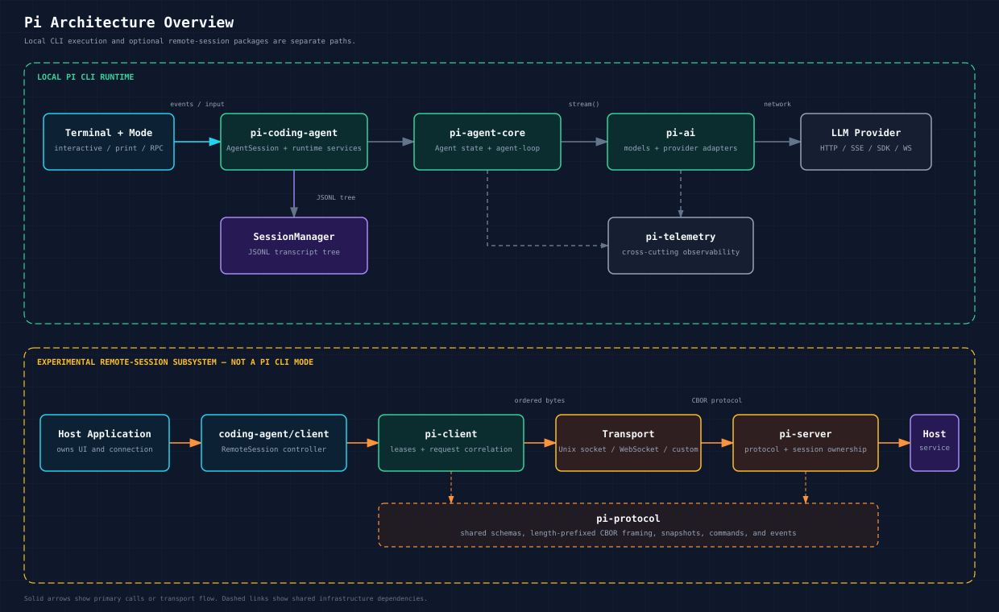
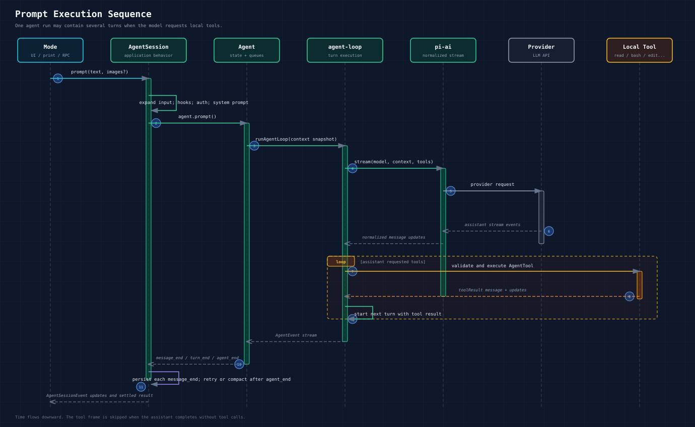

# Architecture Design

## Package Layers

The local CLI runtime is layered from provider APIs up to the user-facing application:

```text
packages/coding-agent
  local application layer; depends on packages/agent, packages/ai, packages/tui

packages/agent
  generic agent runtime; depends on packages/ai

packages/ai
  owns provider adapters, model registries, auth primitives, stream types

packages/tui
  independent terminal UI foundation

packages/telemetry
  shared observability primitives used by packages/ai and packages/agent
```

The intended dependency direction is one-way. `pi-ai` knows nothing about agents. `pi-agent-core` knows nothing about the coding-agent CLI or TUI. `pi-tui` is a reusable rendering layer. `pi-coding-agent` composes these packages into the local `pi` application. Telemetry is a cross-cutting dependency rather than a higher application layer.

The repository also contains an experimental remote-session subsystem:

```text
packages/protocol
  shared CBOR schemas, framing, and wire types

packages/client
  transport-neutral remote-session client; depends on packages/protocol

packages/server
  embeddable remote-session server; depends on packages/protocol and packages/ai

packages/coding-agent/client
  higher-level RemoteSession controller; depends on packages/client and
  packages/protocol
```

`@earendil-works/pi-coding-agent/client` is a separate package export, which is why `pi-client` and `pi-protocol` are dependencies of the coding-agent npm package. The normal `pi` binary does not import this client surface, start a `PiServer`, or provide a remote-connect CLI mode. Host applications must provide the server service and choose a transport, such as a Unix-domain socket or WebSocket.



## Runtime Startup Flow

```text
pi binary
  -> packages/coding-agent/src/cli.ts
  -> main(args)
  -> auth and package/config command fast paths
  -> parse args and version/export fast paths
  -> resolve app mode
  -> run migrations
  -> load startup settings for session selection
  -> choose or create SessionManager
  -> resolve the effective session cwd
  -> create cwd-bound settings, model, resource, extension, and trust services
  -> resolve model, thinking level, scoped models, and tools
  -> create AgentSessionRuntime
  -> dispatch interactive, print, json, or rpc mode
```

Key files:

- `packages/coding-agent/src/main.ts`
- `packages/coding-agent/src/core/agent-session-services.ts`
- `packages/coding-agent/src/core/sdk.ts`
- `packages/coding-agent/src/core/agent-session-runtime.ts`
- `packages/coding-agent/src/core/agent-session.ts`

## Core Agent Flow

The central runtime path for a prompt is:

```text
mode layer
  -> AgentSession.prompt()
  -> Agent.prompt()
  -> runAgentLoop()
  -> streamAssistantResponse()
  -> pi-ai stream function
  -> provider adapter
  -> assistant message events
  -> tool calls, if any
  -> tool result messages
  -> next turn or agent_end
```

`AgentSession` adds application behavior around the generic `Agent`:

- prompt template and skill expansion
- extension input and lifecycle hooks
- auth preflight and model fallback
- dynamic system prompt construction
- session persistence
- model, scoped model, and thinking-level state
- tool registry and active tool selection
- compaction, retry, overflow recovery, and branch summaries
- bash command recording
- tree navigation and export

`Agent` and `agent-loop` stay generic:

- `Agent` owns mutable state, queues, abort handling, event subscriptions, and run settlement.
- `agent-loop` owns turn execution, provider streaming, tool validation, tool execution order, and event sequencing.



## Event Model

`pi-agent-core` emits low-level `AgentEvent` values:

```text
agent_start
turn_start
message_start
message_update
message_end
tool_execution_start
tool_execution_update
tool_execution_end
turn_end
agent_end
```

`AgentSession` subscribes to those events and adds application behavior:

- persistence to `SessionManager`
- extension event translation
- queue display events
- compaction lifecycle events
- retry lifecycle events
- session metadata change events
- thinking-level and model change events

The mode layer consumes `AgentSessionEvent` values:

- interactive mode renders TUI components
- print mode outputs final assistant text or JSON events
- RPC mode sends JSONL events and command responses

## Provider and Model Architecture

`pi-ai` now has two public styles:

1. Modern side-effect-free core through `@earendil-works/pi-ai`.
2. Temporary compatibility API through `@earendil-works/pi-ai/compat`.

Modern core:

- `models.ts` defines `Provider`, `Models`, `MutableModels`, `createModels()`, and `createProvider()`.
- Provider factories live under `providers/*`.
- Concrete API implementations live under `api/*`.
- Lazy API wrappers live under `api/*.lazy.ts`.
- `providers/all.ts` constructs built-in provider and image-provider collections.
- Auth resolution lives under `auth/*`.

Compatibility layer:

- `compat.ts` re-exports the old global registry API, generated catalog reads, and old stream helpers.
- It keeps `registerApiProvider()`, `getApiProvider()`, `stream()`, `complete()`, `streamSimple()`, and `completeSimple()` available for existing callers.
- It is explicitly marked temporary in source.

`pi-coding-agent` now uses a `ModelRuntime` built on the modern `Models` API for built-in providers, `models.json`, credentials, catalog refresh, availability, and extension provider registration. `ModelRegistry` is a synchronous compatibility facade for extensions over that runtime; it does not own a separate global registry.

Some coding-agent paths still import `@earendil-works/pi-ai/compat`, including the default low-level stream function, legacy API composition, compaction helpers, bundled extension compatibility, and image-related setup. New standalone integrations should prefer `createModels()` and provider factories.

## Tool Architecture

Tool layers:

```text
ToolDefinition
  -> wrapped as AgentTool
  -> registered on AgentSession
  -> assigned to agent.state.tools
  -> included in Agent context snapshot
  -> exposed to pi-ai Context.tools
  -> provider converts schema
  -> model emits tool calls
  -> agent-loop executes matching AgentTool locally
```

Built-in tool names:

- `read`
- `bash`
- `edit`
- `write`
- `grep`
- `find`
- `ls`

Default active tools are `read`, `bash`, `edit`, and `write`. `grep`, `find`, and `ls` are built-in read-only helper tools but are off by default unless explicitly enabled or used through SDK/custom flows.

## Session Architecture

Sessions are JSONL files managed by `SessionManager`.

The first line is a `SessionHeader`; following lines are entries with `id`, `parentId`, and `timestamp`. The parent link makes a session a tree instead of a flat transcript.

Entry types include:

- `message`
- `thinking_level_change`
- `model_change`
- `compaction`
- `branch_summary`
- `custom`
- `custom_message`
- `label`
- `session_info`

`SessionManager.buildSessionContext()` converts the selected branch into model restore data, thinking-level restore data, and `AgentMessage[]` context for the runtime.

## Resource Architecture

`DefaultResourceLoader` resolves runtime resources from:

- global config under the agent dir
- project config under `.pi`
- package-provided resources
- command-line paths
- extension-discovered resources
- in-process extension factories

Resource types:

- extensions
- skills
- prompt templates
- themes
- context files such as `AGENTS.md` and `CLAUDE.md`
- custom system prompt and appended system prompt content

Resources are loaded before `AgentSession` builds its runtime. Extensions can later contribute more skill, prompt, and theme paths via `resources_discover`, after which `AgentSession` rebuilds resources and the system prompt.

## Extension Architecture

Extensions are TypeScript or JavaScript modules loaded by the coding-agent package. They can:

- handle lifecycle events
- register commands, flags, keybindings, and tools
- inspect or transform inputs
- intercept tool calls and tool results
- observe or transform provider payloads and responses
- add resources
- add UI widgets, dialogs, and status text
- manage provider registrations
- participate in compaction and tree navigation

Important files:

- `packages/coding-agent/src/core/extensions/types.ts`
- `packages/coding-agent/src/core/extensions/loader.ts`
- `packages/coding-agent/src/core/extensions/runner.ts`
- `packages/coding-agent/src/core/extensions/wrapper.ts`

When sessions are replaced, the previous extension context is invalidated and a fresh context is bound to the new session.

## TUI Architecture

`pi-tui` defines the terminal rendering foundation. `TUI` extends `Container` and manages:

- child components
- focused component
- input listeners
- overlay stack
- terminal resize handling
- cursor placement through `CURSOR_MARKER`
- Kitty/iTerm2 image cleanup
- differential rendering

Interactive coding-agent mode builds on this with chat message components, editor components, selectors, footer/status components, tool renderers, and extension UI primitives.

## State Boundaries

| State | Owner |
| --- | --- |
| Provider factories and model collections | `pi-ai` provider/model modules |
| Legacy provider stream registry | `pi-ai/compat` |
| Coding-agent models, credentials, catalogs, and provider composition | `pi-coding-agent` `ModelRuntime` |
| Generic prompt state and queues | `pi-agent-core` `Agent` |
| Turn execution state | `pi-agent-core` `agent-loop` |
| Session transcript tree | `pi-coding-agent` `SessionManager` |
| Cwd-bound settings, resources, and trust | `pi-coding-agent` runtime services |
| Extension runtime state | `pi-coding-agent` extension runner and extension contexts |
| User interface state | mode-specific code, especially `InteractiveMode` and TUI components |
| Terminal rendering state | `pi-tui` `TUI` |
