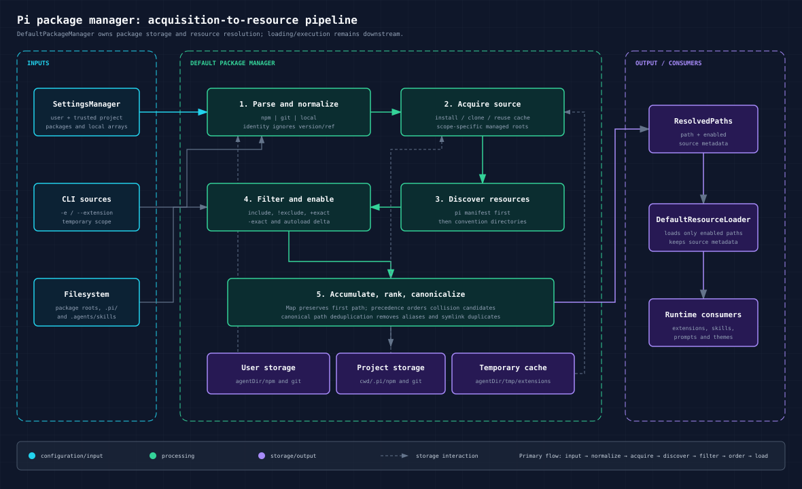
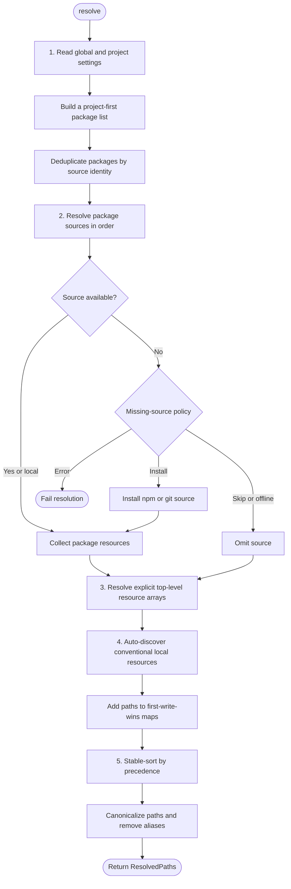

# Package Manager Architecture and Implementation

This document explains [`DefaultPackageManager`](../../packages/coding-agent/src/core/package-manager.ts): what it owns, how its resolution pipeline is designed, and how npm, git, and local packages become loadable extensions, skills, prompts, and themes.

It complements the user-facing [`packages.md`](../../packages/coding-agent/docs/packages.md). That document defines supported package formats and commands. This document focuses on internal control flow, data structures, precedence, storage, filtering, and failure behavior.

## Table of contents

- [1. Purpose and boundary](#1-purpose-and-boundary)
- [2. Public API and core data model](#2-public-api-and-core-data-model)
- [3. Main resolution pipeline](#3-main-resolution-pipeline)
- [4. Precedence and deduplication](#4-precedence-and-deduplication)
- [5. Resource discovery rules](#5-resource-discovery-rules)
- [6. Filtering model](#6-filtering-model)
- [7. Installation and storage](#7-installation-and-storage)
- [8. Install, remove, and settings persistence](#8-install-remove-and-settings-persistence)
- [9. Update semantics](#9-update-semantics)
- [10. Offline mode and error policy](#10-offline-mode-and-error-policy)
- [11. Security properties](#11-security-properties)
- [12. Integration with the rest of coding-agent](#12-integration-with-the-rest-of-coding-agent)
- [13. Concrete traces](#13-concrete-traces)
- [14. Design assessment](#14-design-assessment)
- [15. Source map](#15-source-map)

## 1. Purpose and boundary

`DefaultPackageManager` is both a **package acquisition service** and a **resource-path resolver**.

It is responsible for:

- parsing npm, git, and local package sources;
- installing, removing, updating, and listing configured packages;
- mapping package identities across equivalent source spellings;
- choosing user, project, or temporary storage;
- discovering extensions, skills, prompts, and themes;
- applying package manifests, convention rules, filters, and overrides;
- ordering resources so downstream name-collision handling sees the intended winner first;
- returning source and scope metadata with each path.

It is not responsible for:

- executing extension code;
- parsing a `SKILL.md` into a runtime skill;
- validating theme or prompt content;
- resolving resource-name collisions itself;
- rendering package-management CLI output beyond emitting progress events.

Those tasks belong to consumers such as [`DefaultResourceLoader`](../../packages/coding-agent/src/core/resource-loader.ts) and [`package-manager-cli.ts`](../../packages/coding-agent/src/package-manager-cli.ts).



The architectural boundary is deliberate: the package manager produces an ordered, metadata-rich inventory, while the resource loader decides which enabled resources to load and how to report content-level diagnostics.

## 2. Public API and core data model

The `PackageManager` interface exposes four groups of operations.

| Group | Methods | Purpose |
|---|---|---|
| Resolution | `resolve`, `resolveExtensionSources` | Produce resource paths from settings or temporary CLI sources. |
| Mutation | `install`, `installAndPersist`, `remove`, `removeAndPersist`, `update` | Change managed package storage and, for `*AndPersist`, settings. |
| Inspection | `listConfiguredPackages`, `getInstalledPath`, `checkForAvailableUpdates` | Report configured or installed state. `checkForAvailableUpdates` exists on the concrete class rather than the interface. |
| Integration | `setProgressCallback`, `addSourceToSettings`, `removeSourceFromSettings` | Connect command UI and settings persistence. |

### 2.1 Source types

`parseSource()` normalizes input into one of three internal variants:

```ts
type ParsedSource = NpmSource | GitSource | LocalSource;
```

An npm source records its original spec, package name, optional version/range, and whether the version is exact. A git source records its clone URL, normalized host/path identity, optional ref, and pinned state. A local source retains a filesystem path to resolve against a scope-specific base directory.

Source recognition is intentionally asymmetric:

1. `npm:` always selects npm parsing.
2. A syntactically local path is local before git parsing is attempted.
3. [`parseGitUrl()`](../../packages/coding-agent/src/utils/git.ts) accepts protocol URLs without a prefix, but shorthand such as `github.com/user/repo` or `git@github.com:user/repo` requires `git:`.
4. Anything else falls back to a local path.

The fallback preserves existing local-path behavior, but it also means a misspelled source can surface later as a missing local path rather than an unsupported-source parse error.

### 2.2 Scopes

Every resolved package operates in one of three scopes:

| Scope | Meaning | Settings base | Managed storage |
|---|---|---|---|
| `user` | Global configuration | `agentDir` (normally `~/.pi/agent`) | `agentDir/npm` and `agentDir/git` |
| `project` | Repository/local configuration | `cwd/.pi` | `cwd/.pi/npm` and `cwd/.pi/git` |
| `temporary` | Current-run CLI source | `cwd` | `agentDir/tmp/extensions` |

A user package and a project package are not different package formats. Both can refer to npm, git, or local sources; the name identifies the settings scope that contains the package entry:

- a user package is configured in `~/.pi/agent/settings.json` and applies across projects;
- a project package is configured in `<project>/.pi/settings.json` and applies only within that project.

For example, user settings might contain:

```json
{
  "packages": ["npm:review-tools@1.0.0"]
}
```

The project settings might contain:

```json
{
  "packages": ["npm:review-tools@2.0.0"]
}
```

Inside that project, both entries have the identity `npm:review-tools` because package identity ignores the version. The project entry wins, so version `2.0.0` is resolved from project storage. In another project without that override, the user entry supplies version `1.0.0` from user storage. If the two scopes configure packages with different identities, both packages are resolved.

Project storage and project-relative resolution require a trusted project. `assertProjectTrustedForScope()` enforces this at the storage boundary, while automatic project resource discovery is skipped when trust is absent.

### 2.3 Resolution output

The result is grouped by resource type:

```ts
interface ResolvedResource {
  path: string;
  enabled: boolean;
  metadata: {
    source: string;
    scope: "user" | "project" | "temporary";
    origin: "package" | "top-level";
    baseDir?: string;
  };
}
```

`enabled: false` is retained rather than discarded. This allows configuration UIs and diagnostics to show installed but disabled resources. `DefaultResourceLoader` records metadata for all entries, then loads only enabled ones.

`baseDir` is especially important for skills and package resources. It gives downstream loaders the correct root for resolving relative references and attributing resources to a source.

## 3. Main resolution pipeline

`resolve()` transforms settings into `ResolvedPaths` in five stages.



### Stage 1: read settings and deduplicate packages

The manager reads global and project settings from `SettingsManager`. It builds a project-first package list, then calls `dedupePackages()`.

Package identity ignores versions and refs:

| Source | Identity key |
|---|---|
| npm | `npm:<package-name>` |
| git | `git:<normalized-host>/<normalized-path>` |
| local | `local:<absolute-path-resolved-from-scope-base>` |

This produces useful equivalence:

- `npm:foo@1.0.0` and `npm:foo@2.0.0` identify the same package;
- HTTPS and SSH spellings of the same git repository identify the same package;
- different relative spellings of the same local path identify the same package within their respective settings scopes.

The normal rule is “project package wins.” The exception is a project object with `autoload: false`: it is retained as a delta over the matching user package, and the user package is also retained as the base.

### Stage 2: ensure package sources exist

`resolvePackageSources()` processes packages sequentially in deduplicated order.

For npm and git sources:

1. Compute the scope-specific installed path.
2. Check whether the source is already usable.
3. If missing, either install automatically or consult the optional `onMissing` callback.
4. Collect resources from the resulting package root.

The `onMissing` callback can return:

- `install`: acquire the missing source;
- `skip`: omit it from this resolution pass;
- `error`: fail resolution with `Missing source`.

Normal resource loading calls `resolve()` without a callback, so missing configured packages are installed automatically. Startup theme discovery calls it with `skip`, preventing package installation during the early UI bootstrap pass.

For local sources, no copy or installation occurs. Files are treated as single extensions; directories are scanned as packages. If a directory has neither a manifest nor convention resource directories, the directory itself is returned as an extension entry for the downstream extension loader to interpret.

### Stage 3: resolve explicit top-level resource arrays

After packages, the manager processes `extensions`, `skills`, `prompts`, and `themes` arrays directly from project and global settings.

- Project paths are relative to `cwd/.pi`.
- User paths are relative to `agentDir`.
- Plain entries supply files or directories to scan.
- pattern entries control enabled state.

Project entries are inserted before user entries. Their metadata has `origin: "top-level"` and `source: "local"`.

### Stage 4: auto-discover conventional local resources

The manager scans the standard user directories and, when trusted, project directories:

```text
<base>/extensions
<base>/skills
<base>/prompts
<base>/themes
```

It also scans skills under:

- `~/.agents/skills` as user-scoped resources;
- every `.agents/skills` from `cwd` upward to the git repository root;
- the filesystem root when `cwd` is not inside a git repository.

The home `.agents/skills` directory is excluded from the project ancestor list so the same directory is not assigned both user and project scope.

Auto-discovered resources receive `source: "auto"` and `origin: "top-level"`. Existing settings patterns are applied as enable/disable overrides over the discovered set.

### Stage 5: sort and canonicalize

Resources accumulate in one `Map` per resource type. `addResource()` is first-write-wins for an exact path. `toResolvedPaths()` then:

1. converts maps into arrays;
2. stable-sorts entries by precedence rank;
3. canonicalizes filesystem paths;
4. removes duplicate canonical paths.

Canonicalization handles equivalent path spellings and symlink aliases. It does not resolve logical resource-name collisions such as two different `SKILL.md` files declaring the same skill name. The output ordering makes the intended candidate appear first so downstream loaders can resolve that collision consistently.

## 4. Precedence and deduplication

There are two separate precedence systems. They solve different problems.

### 4.1 Package identity precedence

This decides whether the same configured package is resolved once or twice.

```text
project package
    wins over
user package
```

For `autoload: false`, the project package becomes an override delta and the user package remains as its base.

### 4.2 Resource ordering precedence

This orders different paths that may later collide by logical name:

| Rank | Resource origin |
|---:|---|
| 0 | Project explicit top-level setting |
| 1 | Project auto-discovered resource |
| 2 | User explicit top-level setting |
| 3 | User auto-discovered resource |
| 4 | Any package resource |

All package resources share rank 4. Project packages are nevertheless collected before user packages, and JavaScript’s stable sort preserves that project-first order among equal ranks.

The distinction is necessary. Package deduplication answers “which installation/configuration represents this package?” Resource ordering answers “which resource should a downstream first-wins loader see first?”

## 5. Resource discovery rules

### 5.1 Package manifest first

[`readPiManifest()`](../../packages/coding-agent/src/core/pi-manifest.ts) parses `package.json` and returns the `pi` object’s valid string-array resource fields.

For a string-form package entry, a `pi` object owns package discovery. Convention directories are not used as a fallback for omitted resource types. This means an empty `pi` object represents an explicit manifest with no declared resources.

Object-form package entries take a per-resource path through `collectDefaultResources()` or `collectManifestFiles()`. For these entries, a resource type omitted from the manifest can fall back to its convention directory. This implementation detail matters when adding filters to a package whose manifest declares only some resource types.

Malformed JSON or a missing/non-object `pi` field returns `null`, allowing convention fallback. Within a valid `pi` object, an invalid field is ignored without discarding other valid fields.

Manifest entries can be:

- exact files;
- directories;
- glob expressions containing `*` or `?`;
- override expressions beginning with `!`, `+`, or `-`.

Positive entries establish the candidate set. Override entries then alter which candidates are enabled. For a resource type declared by the manifest, a settings filter cannot escape that manifest candidate set.

One subtle path rule: manifest paths use Node’s `path.resolve(packageRoot, entry)`. A leading `~` is therefore package-relative text, not home-directory expansion.

### 5.2 Convention directories

Without a manifest, these package-root directories are recognized:

| Directory | Discovery behavior |
|---|---|
| `extensions/` | Smart entry-point discovery for `.ts`/`.js`. Top-level files load directly. A child directory contributes its `pi.extensions`, `index.ts`, or `index.js`; helper modules beside that entry point are not independently loaded. |
| `skills/` | Finds directories containing `SKILL.md` recursively. Once a directory contains `SKILL.md`, recursion stops below that skill root. In Pi skill directories, top-level Markdown files are also accepted. |
| `prompts/` | Recursively collects `.md` files. |
| `themes/` | Recursively collects `.json` files. |

The auto-discovery rules for top-level `.pi` directories are intentionally narrower for prompts and themes: only direct child `.md` or `.json` files are collected. Package convention directories use recursive collection.

### 5.3 Ignore files and filesystem behavior

Recursive discovery honors rules from:

- `.gitignore`;
- `.ignore`;
- `.fdignore`.

Rules are rebased to the scan root as traversal enters nested directories. Hidden entries and `node_modules` are skipped. Symbolic links are inspected with `statSync()` and followed when they resolve to a file or directory. Broken links and filesystem read errors are ignored.

Auto-discovery starts with a fresh ignore matcher at the configured resource directory. A parent repository `.gitignore` does not implicitly suppress `.pi` resources.

## 6. Filtering model

Filters appear in three places:

1. manifest resource arrays;
2. object-form entries in `settings.packages`;
3. top-level resource arrays in settings.

The pattern vocabulary is shared:

| Form | Meaning |
|---|---|
| `pattern` | Include matches. If at least one normal include exists, non-matching candidates are disabled. |
| `!pattern` | Exclude glob/name/path matches. |
| `+path` | Force-include one exact path after exclusions. |
| `-path` | Force-exclude one exact path after force-includes. This has the final say. |

Matching accepts a path relative to the base directory, a basename, or an absolute normalized path. For `SKILL.md`, it also matches the parent skill directory and its relative/name forms. This lets a user write a skill directory name rather than the literal `SKILL.md` path.

The normal evaluation order is:

```text
normal includes, or all candidates when absent
  → ! exclusions
  → + exact force-includes
  → - exact force-excludes
```

### 6.1 Package object filters

For a normal object-form package entry:

- an omitted resource key loads that resource type normally;
- `[]` records all candidates as disabled;
- a non-empty array applies the pattern algorithm;
- the manifest or convention discovery result remains the upper bound.

Disabled candidates stay in `ResolvedPaths`. This is how `pi config` can display and toggle them.

### 6.2 `autoload: false` as a delta

`autoload: false` changes the meaning of a project package filter. It does not produce the full package state. It produces only explicit enable/disable changes:

- a matching user package supplies the package root and default state;
- the project entry is resolved first as a delta;
- only paths touched by project patterns are inserted;
- the user package then fills in untouched paths;
- first-write-wins preserves project overrides.

Example:

```json
{
  "packages": [
    {
      "source": "npm:review-tools",
      "autoload": false,
      "skills": ["+skills/security", "-skills/style"]
    }
  ]
}
```

If the same package is globally configured, the project entry enables `security`, disables `style`, and inherits the remaining global package state. Without a global base, it behaves as an explicit-only set of path states.

## 7. Installation and storage

### 7.1 npm packages

Managed npm packages share one private install project per scope. `ensureNpmProject()` creates the root, a private `package.json`, and a `.gitignore` that ignores all managed contents. The path is also marked to discourage cloud synchronization where supported.

User resolution has a compatibility fallback: when the Pi-managed user package is absent, `getNpmInstallPath()` checks the global package-manager root. pnpm uses `pnpm list -g --depth 0 --json` because its global layout is not a simple `<root>/<name>` mapping. New user installs always target the Pi-managed root.

`npmCommand` is stored as an argv array, for example:

```json
{
  "npmCommand": ["mise", "exec", "node@20", "--", "npm"]
}
```

The manager preserves argv boundaries and infers the effective package manager after the final `--` wrapper separator. Install flags differ by tool:

| Tool | Managed install strategy |
|---|---|
| npm-compatible default | `install <specs> --prefix <root> --legacy-peer-deps` |
| bun | `install <specs> --cwd <root> --omit=peer` |
| pnpm | `install <specs> --prefix <root>` with auto peer installation and strict peer/dependency-build checks disabled |

Peer resolution is deliberately disabled for managed extension packages because Pi provides its own APIs through loader aliases and virtual modules. Installing separate host peer copies can create version conflicts and break updates.

For git package dependencies, the default command is `npm install --omit=dev`. If a custom `npmCommand` is configured, the manager uses plain `install`, leaving wrapper-specific policy to that command.

### 7.2 Git packages

Git checkout paths are derived from normalized host and repository path beneath the selected git root. `resolveManagedPath()` verifies that the final path cannot escape the managed root, including path traversal encoded in a source.

A new installation performs:

```text
git clone
  → optional git checkout <configured-ref>
  → dependency install when package.json exists
```

If clone, checkout, or dependency installation fails, the new checkout is removed and now-empty parent directories are pruned.

An existing checkout is reconciled rather than merged:

```text
fetch only the target ref
  → resolve current and target commits
  → if changed: reset --hard <target>
  → git clean -fdx
  → reinstall dependencies
```

This destructive behavior is safe only because these directories are package-manager-owned caches, not user working copies. Local packages are never processed this way.

An adjacent `.pi-update-incomplete` marker makes reconciliation recoverable. The marker is written before reset/clean and removed only after dependencies are installed. If a later run sees equal commits but the marker remains, it repeats cleanup and dependency installation. Missing dependencies are also repaired when the checkout is already current.

### 7.3 Temporary packages

`resolveExtensionSources(..., { temporary: true })` installs into a mode-`0700` directory under `agentDir/tmp/extensions`. A SHA-256-derived prefix prevents source layouts from directly controlling the cache root.

Unpinned temporary git sources refresh during resolution. Refresh failure is swallowed so a cached checkout can still be used. Pinned temporary sources and all temporary sources in offline mode avoid refresh.

## 8. Install, remove, and settings persistence

Mutation and persistence are intentionally separable:

- `install()` and `remove()` change storage only;
- `installAndPersist()` installs, then adds/updates settings;
- `removeAndPersist()` removes storage, then removes the matching setting.

Local installs/removals only validate or update settings because no managed copy exists.

Settings matching uses identity rather than exact source text. Installing the same npm package or git repository with a new version/ref updates the existing entry instead of appending a duplicate. If the existing entry is object-form, its resource filters are preserved while its `source` string changes.

Local sources are persisted relative to the settings base:

- global local packages relative to `agentDir`;
- project local packages relative to `cwd/.pi`.

This makes settings portable within their intended scope. Removal accepts an equivalent absolute or relative spelling because comparison resolves both sides before matching.

Progress reporting wraps mutations with `start`, `complete`, and `error` events. The package CLI currently prints start messages and final command-specific success/error output.

## 9. Update semantics

Updates distinguish exact pins from movable targets.

### 9.1 npm

- Exact semantic versions are pinned and skipped by normal update operations.
- Ranges and unversioned specs are update candidates.
- Resolution does not query npm for every installed unpinned package; it accepts the installed version when it satisfies the configured range.
- An exact pin whose installed version is wrong is reinstalled during resolution.
- Explicit updates compare the installed version with `npm view <spec> version --json` using a 10-second network timeout.
- Updates are batched by user/project scope so one package-manager invocation can update multiple npm packages.

If the version lookup fails during an explicit update decision, the manager preserves update behavior by attempting installation. Background availability checks are conservative and report no update on lookup failure.

### 9.2 git

- Unpinned sources follow their configured upstream branch or the remote default branch.
- Pinned refs never move beyond the configured ref, but `update()` still reconciles the checkout to that ref. This matters when settings changed from one ref to another.
- Fetches are narrow: the manager requests only the branch/ref needed for reconciliation.
- Git update tasks run with concurrency 4.

Background availability checks compare local `HEAD` with a remote `ls-remote` result and skip pinned sources. Remote checks disable terminal credential prompting and have a 10-second timeout.

### 9.3 Target selection and concurrency

`update(source)` matches configured packages by identity, so the input may differ in version/ref spelling. When no identity matches, the error can suggest the configured `npm:` or `git:` form.

Npm availability checks use concurrency 4. After selection, user npm updates, project npm updates, and bounded-concurrency git updates run in parallel.

## 10. Offline mode and error policy

`PI_OFFLINE=1`, `true`, or `yes` disables network-dependent work:

- `update()` becomes a no-op;
- availability checks return no updates;
- missing npm/git packages are skipped during resolution;
- temporary git refresh is skipped.

The manager uses different error policies for different phases:

| Situation | Policy |
|---|---|
| Explicit install/remove/update | Throw; caller reports failure. |
| Missing configured source during normal online resolution | Install automatically. |
| Missing source with callback | Obey `install`, `skip`, or `error`. |
| Temporary git refresh failure | Keep cached checkout and continue. |
| Resource directory read/stat failure | Ignore the unreadable entry and continue. |
| Malformed package JSON | Treat as no manifest and use convention discovery. |
| Invalid field inside a valid `pi` object | Ignore that field; retain valid fields. |
| Background update probe failure | Return no reported update for that source. |

This split keeps explicit administrative operations strict while making startup resource discovery tolerant of optional or temporarily inaccessible content.

## 11. Security properties

The public warning in `packages.md` remains the primary security fact: extensions execute code and skills can direct model actions, so installing a package grants broad capability.

The implementation adds containment around package management itself:

- project sources and storage are unavailable until the project is trusted;
- managed git paths are validated against traversal and root escape;
- temporary storage is permissioned `0700`;
- child processes receive argv arrays rather than shell-concatenated commands;
- remote git probes disable interactive credential prompts;
- failed new git checkouts are deleted instead of leaving partial installations;
- update markers repair interrupted destructive reconciliations.

These controls protect storage integrity and startup behavior. They do not sandbox package code.

## 12. Integration with the rest of coding-agent

### `SettingsManager`

Provides global/project package arrays, local resource arrays, `npmCommand`, and the project-trust state. The package manager uses its setter methods so persistence and modification tracking remain centralized.

### `DefaultResourceLoader`

Calls `resolve()` for configured resources and `resolveExtensionSources()` for temporary CLI packages. It stores path metadata, discards disabled entries for actual loading, then delegates each resource type to its specialized loader.

### Startup UI

Resolves only global themes with project trust disabled and an `onMissing` policy of `skip`. This prevents the initial interface from blocking on package installation before normal startup and trust resolution.

### Package CLI

Creates a manager for `install`, `remove`, `list`, and package-update targets. It enforces command-line trust flags before invoking project-local mutations and maps progress events to terminal output.

### Interactive update notification

Calls `checkForAvailableUpdates()` to detect movable npm and git packages without modifying storage. The check is bounded and disabled offline.

## 13. Concrete traces

### 13.1 Resolve a project npm package

Given trusted `.pi/settings.json`:

```json
{
  "packages": ["npm:@acme/review-tools@^2.0.0"]
}
```

The trace is:

```text
read project settings
  → parse npm name @acme/review-tools and range ^2.0.0
  → identity npm:@acme/review-tools
  → choose cwd/.pi/npm/node_modules/@acme/review-tools
  → install if absent or installed version is outside ^2.0.0
  → read package.json pi manifest, otherwise scan convention dirs
  → emit resources with scope=project, origin=package
  → sort package paths after top-level local resources
  → DefaultResourceLoader loads enabled paths
```

### 13.2 Project filter overrides a global package

Global settings load all of `npm:team-tools`. Project settings contain an `autoload: false` entry that disables one skill.

```text
dedupe detects the same npm identity
  → retain project delta first and global base second
  → project delta inserts disabled path
  → global package attempts to insert every path
  → first-write-wins preserves the disabled project path
  → untouched global paths are inserted normally
```

### 13.3 Update an unpinned git package after a force-push

```text
resolve upstream/default target
  → fetch exact remote branch
  → compare local HEAD and fetched commit
  → write incomplete-update marker
  → reset --hard to fetched commit
  → clean -fdx, including old dependencies
  → reinstall runtime dependencies
  → remove marker
```

Because reconciliation uses commit equality and reset rather than merge/fast-forward assumptions, it also recovers from rewritten remote history.

## 14. Design assessment

The implementation favors deterministic startup over a conventional “package manager only installs packages” boundary. That choice is visible in the single class owning acquisition, discovery, filtering, and ordering.

The benefits are concrete:

- source scope and resource metadata stay consistent;
- missing packages can be repaired during resolution;
- project/user precedence is applied before downstream loaders diverge;
- npm, git, and local packages expose one resolution interface;
- configuration UIs can see disabled resources without independently rescanning packages.

The main cost is breadth. `package-manager.ts` contains filesystem traversal, pattern semantics, npm and git process orchestration, settings identity logic, update recovery, and resource ordering. Changes to this file should therefore be classified by subsystem and tested against the corresponding behavior group rather than treated as one generic package-manager change.

A useful mental model is:

```text
Package manager = source acquisition + resource inventory policy
Resource loader  = enabled-resource loading + content diagnostics
```

That division explains why `ResolvedPaths` contains both disabled entries and metadata, and why resource precedence is computed before any extension, skill, prompt, or theme is actually parsed.

## 15. Source map

| Concern | Primary implementation |
|---|---|
| Public behavior and package authoring | [`packages.md`](../../packages/coding-agent/docs/packages.md) |
| Main orchestration, discovery, filters, storage, updates | [`package-manager.ts`](../../packages/coding-agent/src/core/package-manager.ts) |
| Manifest parsing and field validation | [`pi-manifest.ts`](../../packages/coding-agent/src/core/pi-manifest.ts) |
| Git URL parsing and normalized identity inputs | [`git.ts`](../../packages/coding-agent/src/utils/git.ts) |
| Settings schema, trust state, and persistence | [`settings-manager.ts`](../../packages/coding-agent/src/core/settings-manager.ts) |
| Consumption of `ResolvedPaths` | [`resource-loader.ts`](../../packages/coding-agent/src/core/resource-loader.ts) |
| CLI command wiring | [`package-manager-cli.ts`](../../packages/coding-agent/src/package-manager-cli.ts) |
| Main behavioral coverage | [`package-manager.test.ts`](../../packages/coding-agent/test/package-manager.test.ts) |
| Git reconciliation coverage | [`git-update.test.ts`](../../packages/coding-agent/test/git-update.test.ts) |
