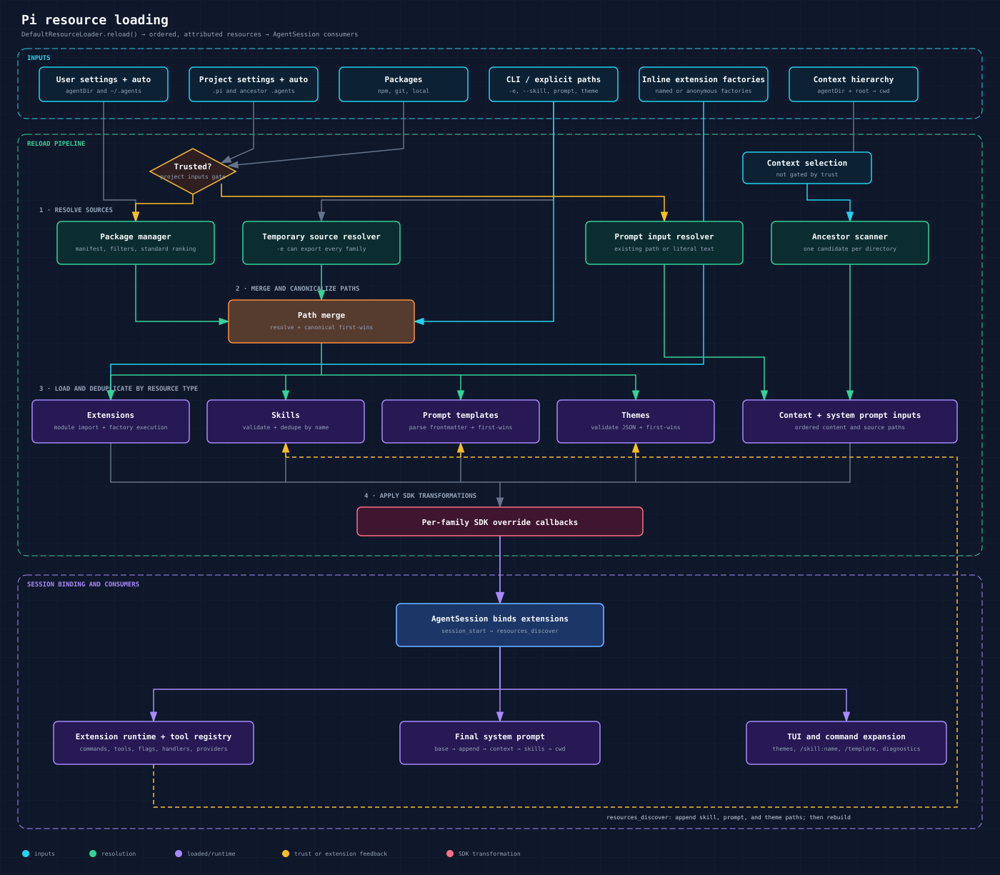

# Resource Loading

Pi uses `DefaultResourceLoader` to assemble extensions, skills, prompt templates, themes, context files, and system-prompt inputs for a session. This page documents the unified pipeline. The implementation in [`resource-loader.ts`](../../packages/coding-agent/src/core/resource-loader.ts) is the source of truth; the resource-specific pages describe authoring and usage.

<p align="center"></p>

## Table of Contents

- [Resource Families](#resource-families)
- [Lifecycle](#lifecycle)
  - [Construction](#construction)
  - [Reload](#reload)
  - [Project-trust bootstrap](#project-trust-bootstrap)
  - [Extension-contributed resources](#extension-contributed-resources)
- [Inputs and Discovery Locations](#inputs-and-discovery-locations)
- [File Discovery Rules](#file-discovery-rules)
- [Path Resolution and Deduplication](#path-resolution-and-deduplication)
- [Precedence](#precedence)
  - [Standard resource order](#standard-resource-order)
  - [Explicit input order](#explicit-input-order)
  - [Name collisions](#name-collisions)
  - [Disable flags](#disable-flags)
- [Settings and Package Filters](#settings-and-package-filters)
- [Context Files](#context-files)
- [System-Prompt Inputs and Composition](#system-prompt-inputs-and-composition)
  - [Replacement prompt](#replacement-prompt)
  - [Appended prompts](#appended-prompts)
  - [Path-or-literal behavior](#path-or-literal-behavior)
  - [Final order](#final-order)
- [SDK Overrides](#sdk-overrides)
- [Source Metadata](#source-metadata)
- [Diagnostics and Failure Behavior](#diagnostics-and-failure-behavior)
- [Reload Semantics](#reload-semantics)
- [Related Documentation](#related-documentation)

## Resource Families

| Resource | Loader result | Runtime use |
|---|---|---|
| Extensions | `getExtensions()` | Registers tools, commands, flags, event handlers, providers, and UI behavior |
| Skills | `getSkills()` | Adds skill metadata to the system prompt and powers `/skill:name` |
| Prompt templates | `getPrompts()` | Expands `/name` commands into prompts |
| Themes | `getThemes()` | Registers custom TUI themes; built-in `dark` and `light` themes are separate |
| Context files | `getAgentsFiles()` | Appends layered `AGENTS.md` or `CLAUDE.md` instructions to the system prompt |
| System prompt | `getSystemPrompt()` | Replaces pi's default system prompt when present |
| Appended system prompts | `getAppendSystemPrompt()` | Appends one or more strings to either the default or replacement system prompt |

The loader owns discovery and parsing. `AgentSession` consumes its results, builds the final system prompt, and binds the extension runtime. The TUI consumes themes and displays loaded-resource diagnostics.

## Lifecycle

### Construction

`new DefaultResourceLoader(...)` normalizes `cwd` and `agentDir` and initializes every resource result to an empty collection. If no settings manager is supplied, construction creates one and may read settings files, but it does not discover resource files. Call `await loader.reload()` before using the loader.

When `createAgentSession()` creates its own loader, it calls `reload()` automatically. When a `resourceLoader` is passed to `createAgentSession()`, the caller owns initialization.

### Reload

`reload()` performs these steps in order:

1. Reset extension timing data. On every reload after the first, clear the extension module cache.
2. Optionally run the project-trust bootstrap described below.
3. Reload settings for the resolved trust state.
4. Resolve configured packages, local settings entries, and auto-discovered resources through `DefaultPackageManager`.
5. Resolve temporary `-e`/`--extension` sources. A temporary source may be a single extension or a package containing any resource family.
6. Normalize, canonicalize, and deduplicate resource paths while preserving the first occurrence.
7. Load extensions, then skills, prompts, and themes.
8. Load context files.
9. Resolve replacement and appended system-prompt inputs.
10. Apply the corresponding SDK override to each loaded result.
11. Mark the loader as loaded.

Extension factories passed with `extensionFactories` are loaded after file-backed extensions. They are not disabled by `noExtensions`.

### Project-trust bootstrap

When `reload({ resolveProjectTrust })` is used, extension loading has two passes:

1. Pi forces the settings manager into the untrusted state and loads only user/global extensions, temporary CLI `-e` extensions, and inline extension factories.
2. The caller resolves trust using that preliminary extension result. These early extensions can handle `project_trust`.
3. Pi reloads settings under the selected trust state and resolves the final resource set.
4. Preliminary extensions that are still present are reused. Their modules and factories are not executed twice. Failed preliminary paths are not retried in the same reload. Newly allowed project extensions load into the same extension runtime.

Project trust protects project settings, `.pi` resources, project packages, and project or ancestor `.agents/skills`. It does not protect context files: `AGENTS.md` and `CLAUDE.md` still load unless `noContextFiles` is set. See [Security](../../packages/coding-agent/docs/security.md#project-trust).

`DefaultResourceLoader` consumes trust state but does not choose a trust policy by itself. Without `resolveProjectTrust`, it preserves the current `SettingsManager.projectTrusted` value. A directly created `SettingsManager` defaults to trusted; the CLI supplies the trust-resolution flow around the loader.

### Extension-contributed resources

After extensions are bound, `AgentSession` emits `session_start`, followed by `resources_discover`. Handlers may return additional skill, prompt, and theme paths. Pi then calls `extendResources()` and rebuilds the system prompt.

Extension contributions:

- may add skills, prompts, and themes, but not extensions, context files, or system-prompt files;
- are appended after the paths already loaded, so an existing same-name resource wins;
- are normalized relative to `cwd` and accept filesystem paths or `file:` URLs;
- receive temporary `SourceInfo` metadata tied to the contributing extension;
- run with `reason: "startup"` after starting, resuming, forking, or replacing a session, and with `reason: "reload"` after reload.

## Inputs and Discovery Locations

`agentDir` is normally `~/.pi/agent`. `CONFIG_DIR_NAME` is `.pi`.

| Input | User scope | Project scope | Trust requirement |
|---|---|---|---|
| Auto extensions | `<agentDir>/extensions/` | `<cwd>/.pi/extensions/` | Project only |
| Auto skills | `<agentDir>/skills/`, `~/.agents/skills/` | `<cwd>/.pi/skills/`, `.agents/skills/` from `cwd` through the repository root | Project only |
| Auto prompts | `<agentDir>/prompts/` | `<cwd>/.pi/prompts/` | Project only |
| Auto themes | `<agentDir>/themes/` | `<cwd>/.pi/themes/` | Project only |
| Settings paths | `<agentDir>/settings.json` | `<cwd>/.pi/settings.json` | Project only |
| Packages | User `packages` setting | Project `packages` setting | Project only |
| Replacement prompt | `<agentDir>/SYSTEM.md` | `<cwd>/.pi/SYSTEM.md` | Project only |
| Appended prompt | `<agentDir>/APPEND_SYSTEM.md` | `<cwd>/.pi/APPEND_SYSTEM.md` | Project only |
| Context | `<agentDir>` | Every directory from filesystem root through `cwd` | None |

Explicit constructor inputs add other sources:

- `additionalExtensionPaths`: the same source syntax as CLI `-e`, including local paths, npm packages, and Git packages;
- `additionalSkillPaths`, `additionalPromptTemplatePaths`, and `additionalThemePaths`: direct files or directories;
- `extensionFactories`: in-memory extension factories;
- `systemPrompt` and `appendSystemPrompt`: literal strings or paths;
- one override callback per result family.

## File Discovery Rules

Discovery depends on both resource type and how the path entered the loader.

| Resource | Auto-discovered directory | Package, manifest, or settings directory | Direct additional or extension-contributed directory |
|---|---|---|---|
| Extensions | Direct `.ts`/`.js`; one-level subdirectories with `index.ts`, `index.js`, or `pi.extensions`; a manifest or index at the root takes over | Same extension entry-point rules | A direct `-e` directory is treated as a package/source; a bare directory may resolve as an extension module |
| Skills | Recursive `SKILL.md`; direct root `.md` also loads in `.pi/skills` and `<agentDir>/skills` | Recursive `SKILL.md`; direct root `.md` | Recursive `SKILL.md`; direct root `.md` |
| Prompts | Direct `.md` files only | Directory entries are expanded recursively before parsing | Direct `.md` files only within the supplied directory |
| Themes | Direct `.json` files only | Directory entries are expanded recursively before parsing | Direct `.json` files only within the supplied directory |

Additional scanning behavior:

- Hidden entries and `node_modules` are skipped during recursive discovery.
- `.gitignore`, `.ignore`, and `.fdignore` rules are applied while collecting package-managed resources and skills.
- Symlinked files and directories are followed when their targets can be statted.
- Broken symlinks and most directory-read failures are skipped.
- A skill directory containing `SKILL.md` is a terminal skill root; discovery does not recurse beneath it for more skills.
- In `.agents/skills`, root `.md` files are ignored; only `SKILL.md` roots are recognized.
- Project `.agents/skills` traversal stops at the Git repository root. Outside a Git repository it continues to the filesystem root.

## Path Resolution and Deduplication

The constructor resolves `cwd` and `agentDir` immediately. Resource paths are resolved relative to `cwd` unless another layer supplies a base directory:

- user settings paths are relative to `agentDir`;
- project settings paths are relative to `<cwd>/.pi`;
- package manifest paths are relative to the package root;
- extension-contributed paths are normalized relative to `cwd`, while their metadata `baseDir` is resolved separately;
- `~` and `file:` URLs are supported by the shared path resolver.

Before loading, `mergePaths()` resolves each path, canonicalizes it through the filesystem, and retains the first occurrence. This removes duplicate paths reached through symlinks or different spellings. It does not deduplicate different files that declare the same logical name; that happens after parsing.

## Precedence

Precedence has two stages: path ordering, then resource-specific collision handling.

### Standard resource order

`DefaultPackageManager` sorts ordinary discovered resources from highest to lowest precedence:

1. Project settings entries: `source: "local", scope: "project"`
2. Project auto-discovery: `source: "auto", scope: "project"`
3. User settings entries: `source: "local", scope: "user"`
4. User auto-discovery: `source: "auto", scope: "user"`
5. Package resources: `origin: "package"`

All package resources share the fifth rank. Package resolution starts with project package settings and then user package settings. If the same package identity appears in both scopes, the project entry replaces the user entry, except for a project `autoload: false` delta. Package identity is npm package name, Git host/repository without ref, or resolved local path.

### Explicit input order

The loader combines paths in this order:

| Resource | Highest to lowest path order |
|---|---|
| Extensions | Temporary CLI `-e` sources → ordinary resolved extensions, unless disabled → inline factories |
| Skills | Skills exported by temporary `-e` packages → ordinary resolved skills, unless disabled → direct `additionalSkillPaths` → `resources_discover` additions |
| Prompts | Prompts exported by temporary `-e` packages → ordinary resolved prompts, unless disabled → direct `additionalPromptTemplatePaths` → `resources_discover` additions |
| Themes | Themes exported by temporary `-e` packages → ordinary resolved themes, unless disabled → direct `additionalThemePaths` → `resources_discover` additions |

This means an explicit direct skill, prompt, or theme path is additive but does not automatically override a same-name resource loaded earlier. Use an override callback when replacement semantics are required.

### Name collisions

| Resource | Collision key | Behavior |
|---|---|---|
| Skills | Frontmatter `name`, falling back to parent directory name | First wins; later skill is omitted and a collision diagnostic is emitted |
| Prompts | Filename without `.md` | First wins; later prompt is omitted and a collision diagnostic is emitted |
| Themes | JSON `name`, falling back to `unnamed` | First wins; later theme is omitted and a collision diagnostic is emitted |
| Extension paths | Canonical file path | First path wins; duplicate path is omitted silently |
| Extension tools and flags | Registered name | All extensions remain loaded; conflicts are reported and load order controls precedence |
| Extension commands | Registered name | All remain available with numeric invocation suffixes such as `/review:1` and `/review:2` |

### Disable flags

The `no*` options disable ordinary discovery, not explicit input:

- `noExtensions` retains temporary `-e` sources and inline factories.
- `noSkills` retains skills from temporary `-e` packages and `additionalSkillPaths`.
- `noPromptTemplates` retains prompts from temporary `-e` packages and `additionalPromptTemplatePaths`.
- `noThemes` retains themes from temporary `-e` packages and `additionalThemePaths`.
- `noContextFiles` is absolute for automatic context-file loading, although `agentsFilesOverride` can still inject entries afterward.

## Settings and Package Filters

The `extensions`, `skills`, `prompts`, and `themes` settings accept source paths plus filter patterns. Entries without `*`, `?`, or a control prefix provide the files or directories to scan. Glob includes filter the files collected from those plain entries; they do not create a discovery root by themselves. Override patterns also apply to resources from the corresponding auto-discovery directory:

- `pattern`: include matching paths; if any includes exist, unmatched paths are excluded;
- `!pattern`: exclude matching paths;
- `+path`: force-include an exact path after exclusions;
- `-path`: force-exclude an exact path last.

Patterns match relative paths, basenames, and absolute paths. For `SKILL.md`, they also match the containing skill directory. Exact `+` and `-` skill paths can name the skill directory.

A package may declare `pi.extensions`, `pi.skills`, `pi.prompts`, and `pi.themes`. Without a `pi` manifest, conventional top-level directories with those names are used. Package object settings add a second filter layer:

- omitted resource key: use package defaults;
- empty array: disable that resource family;
- patterns: filter resources already allowed by the manifest;
- `autoload: false`: start with none and apply only explicit enable/disable patterns. A project delta may modify the matching user package installation.

See [Pi Packages](../../packages/coding-agent/docs/packages.md) for installation and manifest authoring.

## Context Files

Context loading is separate from package resolution and project trust.

For each directory, Pi selects the first readable regular file in this order:

1. `AGENTS.override.md`
2. `AGENTS.md`
3. `AGENTS.MD`
4. `CLAUDE.md`
5. `CLAUDE.MD`

Only one context file is selected per directory. The final order is:

1. The first matching file in `agentDir`.
2. Matching ancestor files from filesystem root toward `cwd`.
3. The matching file in `cwd`.

This ordering makes narrower instructions appear later in `<project_context>`. Exact duplicate paths are removed.

Pi normally keeps climbing above a Git repository root. One special case prevents duplicated instructions in a linked worktree nested inside its main repository: when both roots contain the same selected context filename, the main repository copy is skipped because the nested worktree copy shadows the same logical repository scope. Sibling worktrees, bare-repository layouts, submodules, unrelated ancestors, and differently named context files retain normal inheritance.

Unreadable candidates produce a warning and allow the next candidate in the same directory to be tried. Candidates that exist but are directories are skipped.

## System-Prompt Inputs and Composition

### Replacement prompt

`systemPrompt` in the constructor takes precedence over file discovery. Without it, Pi selects:

1. `<cwd>/.pi/SYSTEM.md` when the project is trusted;
2. `<agentDir>/SYSTEM.md`;
3. no replacement, which causes `buildSystemPrompt()` to use pi's default prompt.

### Appended prompts

An explicit `appendSystemPrompt` array replaces append-file discovery, including when it is an empty array. Without it, Pi selects one file:

1. `<cwd>/.pi/APPEND_SYSTEM.md` when the project is trusted;
2. `<agentDir>/APPEND_SYSTEM.md`;
3. none.

Multiple explicit entries are joined with two newlines when `AgentSession` builds the prompt.

### Path-or-literal behavior

Each `systemPrompt` or `appendSystemPrompt` string is interpreted as a file only when that exact path exists at reload time. Otherwise the string itself becomes prompt text. Consequently, a misspelled intended path is treated as literal content. If an existing path cannot be read, Pi warns and also falls back to using the path string as content.

`getSystemPromptSource()` and `getAppendSystemPromptSources()` report only inputs whose paths exist. Literal strings are not reported as sources.

### Final order

`AgentSession` constructs the system prompt in this order:

1. Pi's default prompt, or the replacement prompt.
2. Appended system-prompt text.
3. A `<project_context>` block containing context files in loader order.
4. An `<available_skills>` block, but only when the `read` tool is active. Skills with `disable-model-invocation: true` are omitted from this block.
5. The current working directory.

Skill commands still work for hidden skills when `enableSkillCommands` is enabled. `/skill:name` reads the file at invocation time, strips frontmatter, wraps the body with its location and base directory, and appends command arguments.

## SDK Overrides

Overrides run after the corresponding base result is loaded:

```typescript
const loader = new DefaultResourceLoader({
  cwd,
  agentDir,
  skillsOverride: (base) => ({
    skills: base.skills.filter((skill) => skill.name !== "disabled"),
    diagnostics: base.diagnostics,
  }),
  agentsFilesOverride: (base) => ({
    agentsFiles: [
      ...base.agentsFiles,
      { path: "/virtual/AGENTS.md", content: "Additional instructions" },
    ],
  }),
  appendSystemPromptOverride: (base) => [...base, "Additional system guidance"],
});

await loader.reload();
```

Available callbacks are `extensionsOverride`, `skillsOverride`, `promptsOverride`, `themesOverride`, `agentsFilesOverride`, `systemPromptOverride`, and `appendSystemPromptOverride`.

An override replaces the entire result returned by that stage. Preserve diagnostics explicitly when transforming skills, prompts, or themes. Overrides run again after every reload. Extension-contributed skills, prompts, and themes also pass through their corresponding override each time `extendResources()` rebuilds that family.

For complete control, implement the `ResourceLoader` interface. See [SDK](../../packages/coding-agent/docs/sdk.md#resourceloader) and [`12-full-control.ts`](../../packages/coding-agent/examples/sdk/12-full-control.ts).

## Source Metadata

Extensions, skills, prompts, and themes carry `SourceInfo`:

```typescript
interface SourceInfo {
  path: string;
  source: string;
  scope: "user" | "project" | "temporary";
  origin: "package" | "top-level";
  baseDir?: string;
}
```

Package metadata is propagated to every resource under the resolved package path. Extension-contributed resources use the contributing extension as `source`. When no metadata is available, the loader infers user or project scope from standard directories and otherwise marks the path as temporary local input.

The TUI uses this metadata to group loaded resources and display compact source tags. Commands and tools inherit their extension's source metadata.

## Diagnostics and Failure Behavior

Resource loading is intentionally tolerant: one bad resource generally does not prevent other resources from loading.

| Failure | Result |
|---|---|
| Extension import or factory failure | Entry in `getExtensions().errors`; extension omitted |
| Missing local `additionalExtensionPaths` entry | Extension error with the resolved path |
| Invalid or unreadable skill | Warning diagnostic; missing description prevents loading |
| Missing direct skill path | Warning diagnostic |
| Unreadable prompt file | Silently omitted by the prompt parser |
| Missing direct prompt path | Error diagnostic added by `DefaultResourceLoader` |
| Invalid, unreadable, or missing theme | Warning diagnostic; theme omitted |
| Context read failure | Warning printed to stderr; next filename candidate is tried |
| System-prompt read failure | Warning printed to stderr; input path string becomes prompt content |
| Same-name skill, prompt, or theme | Collision diagnostic; first resource wins |
| Same-name extension tool or flag | Extension error entry; extensions remain loaded |

The interactive startup view displays loaded resources and diagnostics. SDK callers should inspect every result explicitly:

```typescript
const extensionErrors = loader.getExtensions().errors;
const skillDiagnostics = loader.getSkills().diagnostics;
const promptDiagnostics = loader.getPrompts().diagnostics;
const themeDiagnostics = loader.getThemes().diagnostics;
```

## Reload Semantics

Interactive `/reload` and extension `ctx.reload()` perform a full resource reload:

1. Emit `session_shutdown` to the old extension runtime.
2. Invalidate the old runtime and captured extension contexts.
3. Reload settings and resource files.
4. Rebuild the runtime and tool registry while preserving extension flag values.
5. Emit `session_start` with `reason: "reload"`.
6. Emit `resources_discover` with `reason: "reload"` and apply returned resources.
7. Re-register themes and rebuild autocomplete and the system prompt.

`loadExtensionsCached()` caches imported factory functions for the current working directory and cache generation, but it invokes the factory for each ordinary load. A `DefaultResourceLoader` reload after its first completed load clears that cache, reimports modules, and reruns factories. During the two-pass trust bootstrap, Pi reuses preliminary extension objects so their factories execute only once.

The active custom theme also has a separate file watcher for immediate theme-only hot reload. Other resource edits require `/reload` unless an extension updates runtime registrations dynamically.

## Related Documentation

- [Extensions](../../packages/coding-agent/docs/extensions.md)
- [Skills](../../packages/coding-agent/docs/skills.md)
- [Prompt Templates](../../packages/coding-agent/docs/prompt-templates.md)
- [Themes](../../packages/coding-agent/docs/themes.md)
- [Pi Packages](../../packages/coding-agent/docs/packages.md)
- [Settings](../../packages/coding-agent/docs/settings.md#resources)
- [Security](../../packages/coding-agent/docs/security.md#project-trust)
- [SDK](../../packages/coding-agent/docs/sdk.md#resourceloader)
