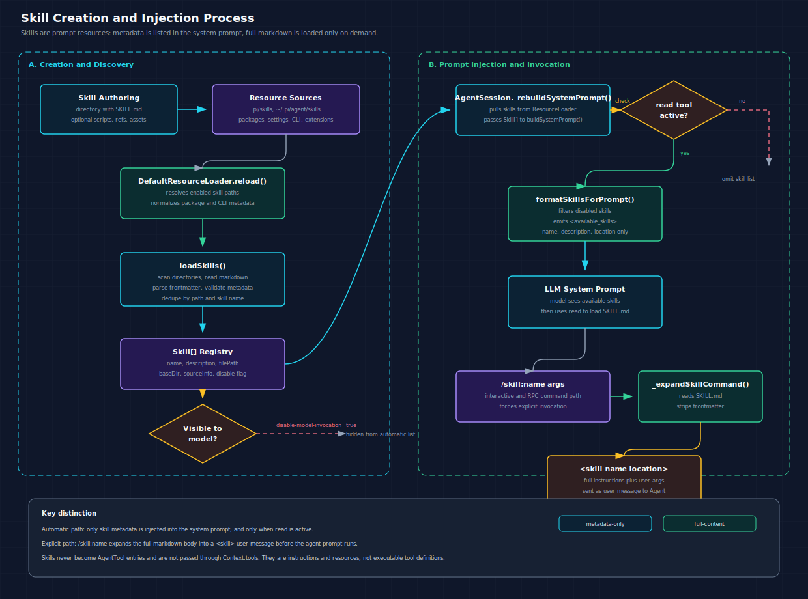

# Skill Creation and Injection Process

This document explains how Pi creates skill metadata from `SKILL.md` files, injects the available skill list into the system prompt, and expands explicit `/skill:name` commands into full skill instructions for the agent and LLM.



## Main Flow

Skills have two injection paths:

1. Discovery and system prompt listing: Pi scans configured skill locations, parses only frontmatter metadata, and appends an `<available_skills>` list to the system prompt.
2. Explicit skill invocation: `/skill:name args` reads the full `SKILL.md`, strips frontmatter, wraps the body in a `<skill>` block, and sends it as a user message.

The important difference from tools: skills are not `AgentTool` objects. They are prompt resources. They never enter `agent.state.tools`, and they are not sent to providers through `Context.tools`.

## 1. Skill File Shape

A skill is usually a directory containing `SKILL.md`, plus optional helper files such as scripts, references, and assets:

```text
my-skill/
+-- SKILL.md
+-- scripts/
|   +-- helper.sh
+-- references/
|   +-- api.md
+-- assets/
    +-- template.json
```

`SKILL.md` starts with frontmatter. Pi uses the frontmatter for discovery and keeps the markdown body for on-demand loading:

```markdown
---
name: my-skill
description: Use when the task needs this specific workflow.
disable-model-invocation: false
---

# My Skill

Follow these steps...
```

The runtime `Skill` shape is defined in [`packages/coding-agent/src/core/skills.ts`](../../packages/coding-agent/src/core/skills.ts):

```ts
export interface SkillFrontmatter {
	name?: string;
	description?: string;
	"disable-model-invocation"?: boolean;
	[key: string]: unknown;
}

export interface Skill {
	name: string;
	description: string;
	filePath: string;
	baseDir: string;
	sourceInfo: SourceInfo;
	disableModelInvocation: boolean;
}
```

Only the metadata above is kept in memory during discovery. Full skill instructions are read later from `filePath`.

## 2. Skill Sources

Skill paths enter the runtime from several places:

| Source | Path or API |
| --- | --- |
| Global Pi skills | `~/.pi/agent/skills/` |
| Global Agent Skills | `~/.agents/skills/` |
| Project Pi skills | `.pi/skills/` |
| Project Agent Skills | `.agents/skills/` in `cwd` and ancestors |
| Packages | `skills/` directories or `pi.skills` in `package.json` |
| Settings | `skills` array in settings |
| CLI | `--skill <path>` |
| Extensions | `resources_discover` event returning `skillPaths` |
| SDK | `DefaultResourceLoader` with `additionalSkillPaths` or `skillsOverride` |

The CLI path is parsed in [`packages/coding-agent/src/cli/args.ts`](../../packages/coding-agent/src/cli/args.ts) and forwarded into resource loader options in [`packages/coding-agent/src/main.ts`](../../packages/coding-agent/src/main.ts):

```ts
} else if (arg === "--skill" && i + 1 < args.length) {
	result.skills = result.skills ?? [];
	result.skills.push(args[++i]);
}
```

```ts
const resolvedSkillPaths = resolveCliPaths(cwd, parsed.skills);

resourceLoaderOptions: {
	additionalSkillPaths: resolvedSkillPaths,
	noSkills: parsed.noSkills,
}
```

Extensions can add skills after `session_start` by returning resource paths from [`resources_discover`](../../packages/coding-agent/src/core/extensions/types.ts):

```ts
export interface ResourcesDiscoverResult {
	skillPaths?: string[];
	promptPaths?: string[];
	themePaths?: string[];
}
```

`AgentSession` applies those extension-discovered paths and rebuilds the system prompt in [`packages/coding-agent/src/core/agent-session.ts`](../../packages/coding-agent/src/core/agent-session.ts):

```ts
const { skillPaths, promptPaths, themePaths } = await this._extensionRunner.emitResourcesDiscover(
	this._cwd,
	reason,
);

this._resourceLoader.extendResources(extensionPaths);
this._baseSystemPrompt = this._rebuildSystemPrompt(this.getActiveToolNames());
this.agent.state.systemPrompt = this._baseSystemPrompt;
```

## 3. Discovery and Metadata Creation

[`DefaultResourceLoader.reload()`](../../packages/coding-agent/src/core/resource-loader.ts) resolves package, settings, CLI, and extension skill resources, then calls `updateSkillsFromPaths()`:

```ts
const skillPaths = this.noSkills
	? this.mergePaths(cliEnabledSkills, this.additionalSkillPaths)
	: this.mergePaths([...cliEnabledSkills, ...enabledSkills], this.additionalSkillPaths);

this.lastSkillPaths = skillPaths;
this.updateSkillsFromPaths(skillPaths, metadataByPath);
```

`--no-skills` skips normal discovery, but explicit CLI/additional skill paths still load.

`updateSkillsFromPaths()` delegates parsing to [`loadSkills()`](../../packages/coding-agent/src/core/skills.ts):

```ts
skillsResult = loadSkills({
	cwd: this.cwd,
	agentDir: this.agentDir,
	skillPaths,
	includeDefaults: false,
});

const resolvedSkills = this.skillsOverride ? this.skillsOverride(skillsResult) : skillsResult;
this.skills = resolvedSkills.skills.map((skill) => ({
	...skill,
	sourceInfo:
		this.findSourceInfoForPath(skill.filePath, this.extensionSkillSourceInfos, metadataByPath) ??
		skill.sourceInfo ??
		this.getDefaultSourceInfoForPath(skill.filePath),
}));
```

Directory discovery follows these rules:

```ts
/**
 * Discovery rules:
 * - if a directory contains SKILL.md, treat it as a skill root and do not recurse further
 * - otherwise, load direct .md children in the root
 * - recurse into subdirectories to find SKILL.md
 */
```

Each candidate markdown file is loaded by `loadSkillFromFile()`:

```ts
const rawContent = readFileSync(filePath, "utf-8");
const { frontmatter } = parseFrontmatter<SkillFrontmatter>(rawContent);
const skillDir = dirname(filePath);
const parentDirName = basename(skillDir);

const name = frontmatter.name || parentDirName;

if (!frontmatter.description || frontmatter.description.trim() === "") {
	return { skill: null, diagnostics };
}

return {
	skill: {
		name,
		description: frontmatter.description,
		filePath,
		baseDir: skillDir,
		sourceInfo: createSkillSourceInfo(filePath, skillDir, source),
		disableModelInvocation: frontmatter["disable-model-invocation"] === true,
	},
	diagnostics,
};
```

`loadSkills()` dedupes by real path and by skill name. On name collision, the first loaded skill wins and a collision diagnostic is recorded.

## 4. System Prompt Injection

`AgentSession` rebuilds the system prompt from active tools, context files, and loaded skills:

```ts
const loadedSkills = this._resourceLoader.getSkills().skills;

this._baseSystemPromptOptions = {
	cwd: this._cwd,
	skills: loadedSkills,
	contextFiles: loadedContextFiles,
	selectedTools: validToolNames,
	toolSnippets,
	promptGuidelines,
};

return buildSystemPrompt(this._baseSystemPromptOptions);
```

[`buildSystemPrompt()`](../../packages/coding-agent/src/core/system-prompt.ts) appends skills only when the `read` tool is active:

```ts
const hasRead = tools.includes("read");

if (hasRead && skills.length > 0) {
	prompt += formatSkillsForPrompt(skills);
}
```

This guard exists because automatic skill usage requires the model to read the full `SKILL.md` itself. If `read` is unavailable, Pi omits the automatic skill list.

[`formatSkillsForPrompt()`](../../packages/coding-agent/src/core/skills.ts) filters out skills with `disable-model-invocation: true` and injects metadata only:

```ts
export function formatSkillsForPrompt(skills: Skill[]): string {
	const visibleSkills = skills.filter((s) => !s.disableModelInvocation);

	const lines = [
		"\n\nThe following skills provide specialized instructions for specific tasks.",
		"Use the read tool to load a skill's file when the task matches its description.",
		"When a skill file references a relative path, resolve it against the skill directory (parent of SKILL.md / dirname of the path) and use that absolute path in tool commands.",
		"",
		"<available_skills>",
	];

	for (const skill of visibleSkills) {
		lines.push("  <skill>");
		lines.push(`    <name>${escapeXml(skill.name)}</name>`);
		lines.push(`    <description>${escapeXml(skill.description)}</description>`);
		lines.push(`    <location>${escapeXml(skill.filePath)}</location>`);
		lines.push("  </skill>");
	}

	lines.push("</available_skills>");
	return lines.join("\n");
}
```

The resulting system prompt contains discoverability data:

```xml
<available_skills>
  <skill>
    <name>my-skill</name>
    <description>Use when the task needs this specific workflow.</description>
    <location>/absolute/path/to/my-skill/SKILL.md</location>
  </skill>
</available_skills>
```

At this stage, the LLM only sees the skill name, description, and location. It must call `read` on the location to load the full instructions.

## 5. Explicit Skill Command Injection

Interactive mode registers skills as slash commands when `enableSkillCommands` is enabled:

```ts
if (this.settingsManager.getEnableSkillCommands()) {
	for (const skill of this.session.resourceLoader.getSkills().skills) {
		const commandName = `skill:${skill.name}`;
		this.skillCommands.set(commandName, skill.filePath);
		skillCommandList.push({
			name: commandName,
			description: this.prefixAutocompleteDescription(skill.description, skill.sourceInfo),
		});
	}
}
```

RPC exposes the same command names through `get_commands`:

```ts
for (const skill of session.resourceLoader.getSkills().skills) {
	commands.push({
		name: `skill:${skill.name}`,
		description: skill.description,
		source: "skill",
		sourceInfo: skill.sourceInfo,
	});
}
```

When the user sends `/skill:name args`, [`AgentSession._expandSkillCommand()`](../../packages/coding-agent/src/core/agent-session.ts) reads the full file and converts it into a user message:

```ts
private _expandSkillCommand(text: string): string {
	if (!text.startsWith("/skill:")) return text;

	const spaceIndex = text.indexOf(" ");
	const skillName = spaceIndex === -1 ? text.slice(7) : text.slice(7, spaceIndex);
	const args = spaceIndex === -1 ? "" : text.slice(spaceIndex + 1).trim();

	const skill = this.resourceLoader.getSkills().skills.find((s) => s.name === skillName);
	if (!skill) return text;

	const content = readFileSync(skill.filePath, "utf-8");
	const body = stripFrontmatter(content).trim();
	const skillBlock = `<skill name="${skill.name}" location="${skill.filePath}">\nReferences are relative to ${skill.baseDir}.\n\n${body}\n</skill>`;
	return args ? `${skillBlock}\n\n${args}` : skillBlock;
}
```

The expanded message looks like this:

```xml
<skill name="my-skill" location="/absolute/path/to/my-skill/SKILL.md">
References are relative to /absolute/path/to/my-skill.

# My Skill

Follow these steps...
</skill>

User arguments after the slash command
```

This path works even for `disable-model-invocation: true` skills because it bypasses the automatic `<available_skills>` list and injects the full skill by explicit user command.

## 6. LLM Boundary

After skill command expansion, `AgentSession` sends the expanded user message through the normal agent path:

```ts
let expandedText = currentText;
if (expandPromptTemplates) {
	expandedText = this._expandSkillCommand(expandedText);
	expandedText = expandPromptTemplate(expandedText, [...this.promptTemplates]);
}
```

From there, the message is just conversation content. Unlike tools:

- No `ToolDefinition` is created for a skill.
- No `AgentTool` wrapper exists for a skill.
- No skill is passed through `Context.tools`.
- The model cannot call a skill as a provider tool.
- The model can read a skill file, follow its instructions, and use normal tools such as `read`, `bash`, `edit`, or `write`.

## 7. Runtime UI Behavior

The TUI treats expanded skill blocks specially for display. It parses the `<skill>` block and renders it with `SkillInvocationMessageComponent`:

```ts
const skillBlock = parseSkillBlock(textContent);
if (skillBlock) {
	const component = new SkillInvocationMessageComponent(
		skillBlock,
		this.getMarkdownThemeWithSettings(),
	);
	this.chatContainer.addChild(component);
}
```

This is only presentation. The LLM receives the same user message content.

The `read` tool also classifies reads of `SKILL.md` as compact skill reads in the interactive UI:

```ts
if (fileName === "SKILL.md") {
	return { kind: "skill", label: basename(dirname(absolutePath)) || fileName };
}
```

## Debugging Checklist

Use this path when a skill is missing or not triggering:

1. Check whether the skill was discovered: `session.resourceLoader.getSkills().skills`.
2. Check `SKILL.md` frontmatter has a non-empty `description`.
3. Check name validation: lowercase letters, numbers, and hyphens.
4. Check for name collisions; first loaded skill wins.
5. Check whether `disable-model-invocation: true` hides it from the automatic system prompt list.
6. Check whether `read` is active. Without `read`, automatic skill listing is omitted.
7. Check whether `enableSkillCommands` is `true` for `/skill:name` completion.
8. Use `/skill:name` to force full skill injection when the model does not choose the skill from metadata.
