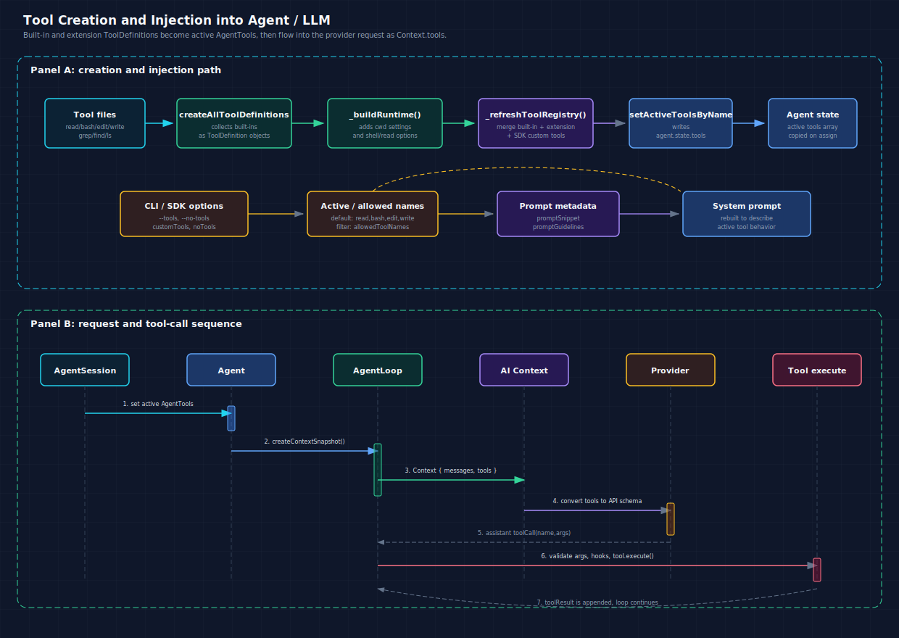

# Tool Creation and Injection Process

This document explains how Pi creates tools such as `read`, `bash`, `edit`, and `write`, injects them into the `Agent`, passes them to the LLM, and executes tool calls returned by the model.



## Main Flow

The tool path has two separate phases:

1. Tool creation and activation: `ToolDefinition` objects are created by `packages/coding-agent`, wrapped into `AgentTool` objects, filtered by runtime options, and assigned to `agent.state.tools`.
2. Request and execution: `packages/agent` snapshots `agent.state.tools`, sends them to `packages/ai` as `Context.tools`, then executes model-emitted tool calls against the same active tool list.

## Tool Shapes and Responsibilities

There are three related tool shapes. They intentionally live at different layers.

| Type | Layer | Purpose |
| --- | --- | --- |
| `Tool` | `packages/ai` | Provider-facing schema only: name, description, parameters. |
| `AgentTool` | `packages/agent` | Runtime executable tool: provider metadata plus local `execute()`. |
| `ToolDefinition` | `packages/coding-agent` | Full app-level declaration: runtime behavior, extension context, prompt metadata, and TUI renderers. |

At the LLM boundary, a tool is only the provider-facing shape from [`packages/ai/src/types.ts`](../../packages/ai/src/types.ts):

```ts
export interface Tool<TParameters extends TSchema = TSchema> {
	name: string;
	description: string;
	parameters: TParameters;
}

export interface Context {
	systemPrompt?: string;
	messages: Message[];
	tools?: Tool[];
}
```

The richer `AgentTool` shape lives in [`packages/agent/src/types.ts`](../../packages/agent/src/types.ts). It extends that provider-facing `Tool` with execution behavior:

```ts
export interface AgentTool<TParameters extends TSchema = TSchema, TDetails = any> extends Tool<TParameters> {
	label: string;
	prepareArguments?: (args: unknown) => Static<TParameters>;
	execute: (
		toolCallId: string,
		params: Static<TParameters>,
		signal?: AbortSignal,
		onUpdate?: AgentToolUpdateCallback<TDetails>,
	) => Promise<AgentToolResult<TDetails>>;
	executionMode?: ToolExecutionMode;
}
```

`ToolDefinition` lives in [`packages/coding-agent/src/core/extensions/types.ts`](../../packages/coding-agent/src/core/extensions/types.ts). It is the source-of-truth shape used by built-in tools, extension tools, SDK custom tools, prompt generation, and interactive rendering:

```ts
export interface ToolDefinition<TParams extends TSchema = TSchema, TDetails = unknown, TState = any> {
	name: string;
	label: string;
	description: string;
	promptSnippet?: string;
	promptGuidelines?: string[];
	parameters: TParams;
	renderShell?: "default" | "self";
	prepareArguments?: (args: unknown) => Static<TParams>;
	executionMode?: ToolExecutionMode;
	execute(
		toolCallId: string,
		params: Static<TParams>,
		signal: AbortSignal | undefined,
		onUpdate: AgentToolUpdateCallback<TDetails> | undefined,
		ctx: ExtensionContext,
	): Promise<AgentToolResult<TDetails>>;
	renderCall?: (...args: unknown[]) => Component;
	renderResult?: (...args: unknown[]) => Component;
}
```

`ToolDefinition` is converted to `AgentTool` by [`wrapToolDefinition()`](../../packages/coding-agent/src/core/tools/tool-definition-wrapper.ts):

```ts
export function wrapToolDefinition<TDetails = unknown>(
	definition: ToolDefinition<any, TDetails>,
	ctxFactory?: () => ExtensionContext,
): AgentTool<any, TDetails> {
	return {
		name: definition.name,
		label: definition.label,
		description: definition.description,
		parameters: definition.parameters,
		prepareArguments: definition.prepareArguments,
		executionMode: definition.executionMode,
		execute: (toolCallId, params, signal, onUpdate) =>
			definition.execute(toolCallId, params, signal, onUpdate, ctxFactory?.() as ExtensionContext),
	};
}
```

So the practical distinction is:

- `ToolDefinition` is what Pi owns and manages: source metadata, UI rendering, prompt snippets, extension context, and execution implementation.
- `AgentTool` is what the core agent loop needs: an active executable tool with a stable `name`, schema, and `execute()`.
- `Tool` is what the provider sees: only `name`, `description`, and `parameters`.

## 1. Built-In Tool Definitions

Each built-in tool exports a `create*ToolDefinition()` function under [`packages/coding-agent/src/core/tools`](../../packages/coding-agent/src/core/tools/index.ts):

```ts
export type ToolName = "read" | "bash" | "edit" | "write" | "grep" | "find" | "ls";

export function createAllToolDefinitions(cwd: string, options?: ToolsOptions): Record<ToolName, ToolDef> {
	return {
		read: createReadToolDefinition(cwd, options?.read),
		bash: createBashToolDefinition(cwd, options?.bash),
		edit: createEditToolDefinition(cwd, options?.edit),
		write: createWriteToolDefinition(cwd, options?.write),
		grep: createGrepToolDefinition(cwd, options?.grep),
		find: createFindToolDefinition(cwd, options?.find),
		ls: createLsToolDefinition(cwd, options?.ls),
	};
}
```

A `ToolDefinition` contains the model-facing metadata (`name`, `description`, `parameters`) plus runtime behavior (`execute`) and UI/rendering metadata used by the interactive mode.

## 2. SDK Chooses Initial Active Tools

[`createAgentSession()`](../../packages/coding-agent/src/core/sdk.ts) chooses which tool names are initially active. By default, the coding tools are active:

```ts
const defaultActiveToolNames: ToolName[] = ["read", "bash", "edit", "write"];
const allowedToolNames = options.tools ?? (options.noTools === "all" ? [] : undefined);
const initialActiveToolNames: string[] = options.tools
	? [...options.tools]
	: options.noTools
		? []
		: defaultActiveToolNames;
```

Those values are passed into `AgentSession`:

```ts
const session = new AgentSession({
	agent,
	sessionManager,
	settingsManager,
	cwd,
	resourceLoader,
	customTools: options.customTools,
	initialActiveToolNames,
	allowedToolNames,
});
```

Important behavior:

- No option: starts with `read`, `bash`, `edit`, `write`.
- `--tools read,bash`: restricts the allowed set and activates matching tools.
- `--no-tools` or `--no-builtin-tools`: starts with no built-in tools, depending on the caller option.
- SDK `customTools` and extension tools are merged later by `AgentSession`.

## 3. Agent Starts with No Tools

The `Agent` is created with an empty tool list in [`packages/coding-agent/src/core/sdk.ts`](../../packages/coding-agent/src/core/sdk.ts):

```ts
agent = new Agent({
	initialState: {
		systemPrompt: "",
		model,
		thinkingLevel,
		tools: [],
	},
	convertToLlm: convertToLlmWithBlockImages,
	streamFn: async (model, context, options) => {
		const auth = await modelRegistry.getApiKeyAndHeaders(model);
		return streamSimple(model, context, {
			...options,
			apiKey: auth.apiKey,
			headers: { ...auth.headers, ...options?.headers },
		});
	},
});
```

The actual tools are installed by `AgentSession` after it builds the runtime.

## 4. AgentSession Builds the Tool Runtime

During construction, [`AgentSession`](../../packages/coding-agent/src/core/agent-session.ts) calls `_buildRuntime()`:

```ts
constructor(config: AgentSessionConfig) {
	this.agent = config.agent;
	this._customTools = config.customTools ?? [];
	this._initialActiveToolNames = config.initialActiveToolNames;
	this._allowedToolNames = config.allowedToolNames ? new Set(config.allowedToolNames) : undefined;

	this._installAgentToolHooks();
	this._buildRuntime({
		activeToolNames: this._initialActiveToolNames,
		includeAllExtensionTools: true,
	});
}
```

`_buildRuntime()` creates the built-in `ToolDefinition` map. It also injects settings into tool construction, such as image auto-resize for `read` and shell settings for `bash`:

```ts
const autoResizeImages = this.settingsManager.getImageAutoResize();
const shellCommandPrefix = this.settingsManager.getShellCommandPrefix();
const shellPath = this.settingsManager.getShellPath();
const baseToolDefinitions = createAllToolDefinitions(this._cwd, {
	read: { autoResizeImages },
	bash: { commandPrefix: shellCommandPrefix, shellPath },
});

this._baseToolDefinitions = new Map(
	Object.entries(baseToolDefinitions).map(([name, tool]) => [name, tool as ToolDefinition]),
);
```

This is the main creation point for built-in tools.

## 5. Built-In, Extension, and SDK Tools Are Merged

`_refreshToolRegistry()` merges all tool sources:

```ts
const registeredTools = this._extensionRunner.getAllRegisteredTools();
const allCustomTools = [
	...registeredTools,
	...this._customTools.map((definition) => ({
		definition,
		sourceInfo: createSyntheticSourceInfo(`<sdk:${definition.name}>`, { source: "sdk" }),
	})),
].filter((tool) => isAllowedTool(tool.definition.name));
```

Then it builds the definition registry used by UI and docs:

```ts
const definitionRegistry = new Map<string, ToolDefinitionEntry>(
	Array.from(this._baseToolDefinitions.entries())
		.filter(([name]) => isAllowedTool(name))
		.map(([name, definition]) => [
			name,
			{
				definition,
				sourceInfo: createSyntheticSourceInfo(`<builtin:${name}>`, { source: "builtin" }),
			},
		]),
);

for (const tool of allCustomTools) {
	definitionRegistry.set(tool.definition.name, {
		definition: tool.definition,
		sourceInfo: tool.sourceInfo,
	});
}
```

Finally it wraps definitions into executable `AgentTool` objects:

```ts
const wrappedExtensionTools = wrapRegisteredTools(allCustomTools, runner);
const wrappedBuiltInTools = wrapRegisteredTools(
	Array.from(this._baseToolDefinitions.values())
		.filter((definition) => isAllowedTool(definition.name))
		.map((definition) => ({
			definition,
			sourceInfo: createSyntheticSourceInfo(`<builtin:${definition.name}>`, { source: "builtin" }),
		})),
	runner,
);

const toolRegistry = new Map(wrappedBuiltInTools.map((tool) => [tool.name, tool]));
for (const tool of wrappedExtensionTools as AgentTool[]) {
	toolRegistry.set(tool.name, tool);
}
this._toolRegistry = toolRegistry;
```

The registry is keyed by tool name. If an extension or SDK custom tool uses the same name as a built-in tool, the later registry write replaces that name.

## 6. Active Tools Are Assigned to the Agent

`setActiveToolsByName()` is the direct injection point into the `Agent`:

```ts
setActiveToolsByName(toolNames: string[]): void {
	const tools: AgentTool[] = [];
	const validToolNames: string[] = [];
	for (const name of toolNames) {
		const tool = this._toolRegistry.get(name);
		if (tool) {
			tools.push(tool);
			validToolNames.push(name);
		}
	}
	this.agent.state.tools = tools;

	this._baseSystemPrompt = this._rebuildSystemPrompt(validToolNames);
	this.agent.state.systemPrompt = this._baseSystemPrompt;
}
```

This line is the key handoff:

```ts
this.agent.state.tools = tools;
```

The same method also rebuilds the system prompt so the prompt text describes the currently active tools.

## 7. Agent Snapshots Tools for a Run

When the user submits a prompt, [`Agent`](../../packages/agent/src/agent.ts) creates a per-run snapshot:

```ts
private createContextSnapshot(): AgentContext {
	return {
		systemPrompt: this._state.systemPrompt,
		messages: this._state.messages.slice(),
		tools: this._state.tools.slice(),
	};
}
```

The loop receives that snapshot through `runAgentLoop()`:

```ts
await runAgentLoop(
	messages,
	this.createContextSnapshot(),
	this.createLoopConfig(options),
	(event) => this.processEvents(event),
	signal,
	this.streamFn,
);
```

This means changes to `agent.state.tools` affect the next run. A run already in progress uses the snapshot it started with.

## 8. AgentLoop Sends Tools to the LLM Context

[`packages/agent/src/agent-loop.ts`](../../packages/agent/src/agent-loop.ts) converts internal messages to LLM messages, then builds the `packages/ai` context:

```ts
const llmMessages = await config.convertToLlm(messages);

const llmContext: Context = {
	systemPrompt: context.systemPrompt,
	messages: llmMessages,
	tools: context.tools,
};

const response = await streamFunction(config.model, llmContext, {
	...config,
	apiKey: resolvedApiKey,
	signal,
});
```

This is where tools enter the LLM request path. At this point the execution-only fields on `AgentTool` are still present in memory, but provider converters only use `name`, `description`, and `parameters`.

## 9. Providers Convert Tools to API-Specific Payloads

`packages/ai` dispatches by model API:

```ts
export function streamSimple<TApi extends Api>(
	model: Model<TApi>,
	context: Context,
	options?: SimpleStreamOptions,
): AssistantMessageEventStream {
	const provider = resolveApiProvider(model.api);
	return provider.streamSimple(model, context, options);
}
```

Each provider converts `Context.tools` to its required payload shape.

OpenAI Chat Completions:

```ts
if (context.tools && context.tools.length > 0) {
	params.tools = convertTools(context.tools, compat);
}

function convertTools(tools: Tool[], compat: ResolvedOpenAICompletionsCompat) {
	return tools.map((tool) => ({
		type: "function",
		function: {
			name: tool.name,
			description: tool.description,
			parameters: tool.parameters as any,
			...(compat.supportsStrictMode !== false && { strict: false }),
		},
	}));
}
```

Anthropic:

```ts
if (context.tools && context.tools.length > 0) {
	params.tools = convertTools(context.tools, isOAuthToken, supportsEagerToolInputStreaming, cacheControl);
}

return tools.map((tool) => ({
	name: isOAuthToken ? toClaudeCodeName(tool.name) : tool.name,
	description: tool.description,
	input_schema: {
		type: "object",
		properties: schema.properties ?? {},
		required: schema.required ?? [],
	},
}));
```

OpenAI Responses:

```ts
export function convertResponsesTools(tools: Tool[], options?: ConvertResponsesToolsOptions): OpenAITool[] {
	const strict = options?.strict === undefined ? false : options.strict;
	return tools.map((tool) => ({
		type: "function",
		name: tool.name,
		description: tool.description,
		parameters: tool.parameters as any,
		strict,
	}));
}
```

Gemini:

```ts
export function convertTools(tools: Tool[], useParameters = false) {
	if (tools.length === 0) return undefined;
	return [
		{
			functionDeclarations: tools.map((tool) => ({
				name: tool.name,
				description: tool.description,
				...(useParameters ? { parameters: sanitizeForOpenApi(tool.parameters) } : { parametersJsonSchema: tool.parameters }),
			})),
		},
	];
}
```

## 10. Tool Calls Come Back and Execute Locally

When the provider emits an assistant message with `toolCall` blocks, `AgentLoop` executes them against the same `currentContext.tools` snapshot:

```ts
const toolCalls = assistantMessage.content.filter((c) => c.type === "toolCall");
const hasSequentialToolCall = toolCalls.some(
	(tc) => currentContext.tools?.find((t) => t.name === tc.name)?.executionMode === "sequential",
);
```

Preparation locates the tool by name, prepares legacy arguments if needed, validates the args against the tool schema, and runs before-tool hooks:

```ts
const tool = currentContext.tools?.find((t) => t.name === toolCall.name);
if (!tool) {
	return {
		kind: "immediate",
		result: createErrorToolResult(`Tool ${toolCall.name} not found`),
		isError: true,
	};
}

const preparedToolCall = prepareToolCallArguments(tool, toolCall);
const validatedArgs = validateToolArguments(tool, preparedToolCall);
```

Execution calls the `AgentTool.execute` function:

```ts
const result = await prepared.tool.execute(
	prepared.toolCall.id,
	prepared.args as never,
	signal,
	(partialResult) => {
		emit({
			type: "tool_execution_update",
			toolCallId: prepared.toolCall.id,
			toolName: prepared.toolCall.name,
			args: prepared.toolCall.arguments,
			partialResult,
		});
	},
);
```

The result becomes a `toolResult` message and is appended to the transcript. The loop then continues so the model can see the result and decide whether to answer, call another tool, or stop.

## Mental Model

Use this mapping when debugging:

| Layer | Owns | Important fields |
| --- | --- | --- |
| `packages/coding-agent/src/core/tools/*` | Built-in tool definitions | `name`, `description`, `parameters`, `execute`, renderers |
| `AgentSession` | Tool registry and active tool selection | `_toolRegistry`, `_toolDefinitions`, `agent.state.tools` |
| `Agent` | Runtime state and run snapshots | `state.tools`, `createContextSnapshot()` |
| `AgentLoop` | LLM request context and local execution | `llmContext.tools`, `prepareToolCall()`, `tool.execute()` |
| `packages/ai` providers | Provider payload formatting | OpenAI `tools`, Anthropic `input_schema`, Gemini `functionDeclarations` |

For most debugging, start at `AgentSession.setActiveToolsByName()` to confirm what is active, then inspect `Agent.createContextSnapshot()` and `streamAssistantResponse()` to confirm the active tools are being included in the request context.
