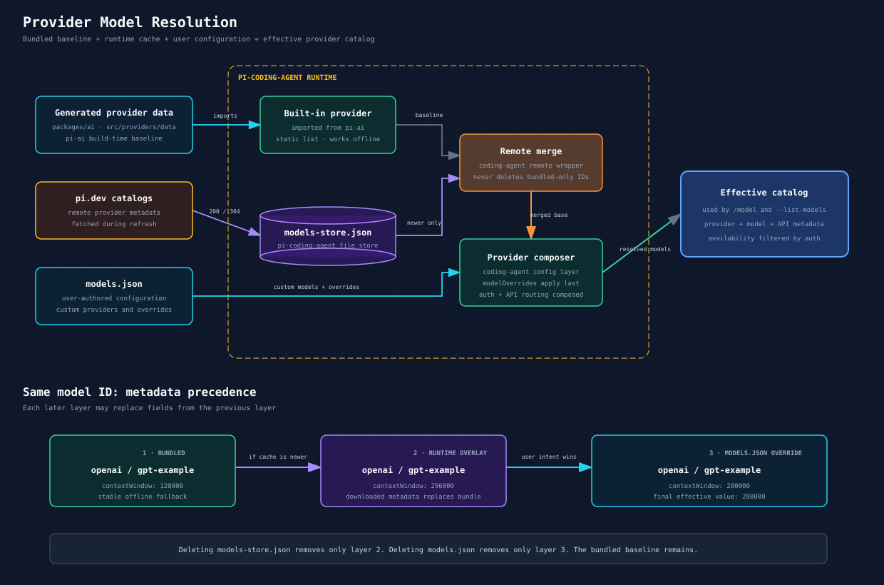

# Provider Model Resolution

Pi combines a pre-built model catalog with newer provider catalogs fetched at runtime. The pre-built catalog is always the baseline. Runtime data is a persistent overlay that can update existing model metadata or add models without rebuilding Pi.



The three inputs have different owners:

- `pi-ai` owns the generated provider data shipped with the package.
- `pi-coding-agent` owns `models-store.json`, which caches remote catalog updates.
- The user owns `models.json`, which declares custom providers and explicit overrides.

## Package and Layer Ownership

Yes: build-time catalog generation happens in `packages/ai`, while the concrete `models-store.json` file is created and maintained by `packages/coding-agent` at runtime.

The complete ownership split is:

| Layer | Package | Main responsibility | Input | Output |
| --- | --- | --- | --- | --- |
| Catalog generation | `packages/ai` | Fetch, normalize, validate, group, and serialize built-in provider models. | Published pi.dev catalog plus direct provider sources. | `src/providers/data/*.json`, `.manifest.json`, provider shards, and `models.generated.ts`. |
| Published model library | `packages/ai` | Expose typed built-in models and provider factories. | Generated catalog files. | `@earendil-works/pi-ai/providers/all`. |
| Store abstraction | `packages/ai` | Define `ModelsStore`, coordinate provider refreshes, and call `read`, `write`, or `delete` on the injected store. | Any `ModelsStore` implementation. | Provider-scoped persisted entries and in-memory catalog updates. |
| Runtime catalog fetching | `packages/coding-agent` | Request newer provider catalogs from pi.dev and merge them over built-ins. | Built-in provider, cached entry, network response. | Runtime provider overlay. |
| Runtime file persistence | `packages/coding-agent` | Implement the locked JSON-backed store. | Entries published through the `pi-ai` store interface. | `~/.pi/agent/models-store.json`. |
| User model configuration | `packages/coding-agent` | Parse `models.json` and compose custom providers, model upserts, and overrides. | `~/.pi/agent/models.json`. | Final configured provider definitions. |
| Request dispatch | `packages/ai` | Route the selected effective model to its API implementation. | Resolved `Model<Api>`, context, credentials, options. | Provider API request and response stream. |

### The cross-package handoff

`pi-ai` does not hardcode `models-store.json`. It only knows the `ModelsStore` interface and defaults to an in-memory implementation when used by itself.

`pi-coding-agent` creates `FileModelsStore` and injects it into `pi-ai`:

```text
packages/coding-agent
  ModelRuntime.create()
    -> new FileModelsStore("~/.pi/agent/models-store.json")
    -> createModels({ modelsStore })
                         |
                         v
packages/ai              ModelsStore interface
  ModelsImpl.refresh()
    -> modelsStore.read(providerId)
    -> provider.refreshModels(context)
    -> modelsStore.write(providerId, publishedEntry)
```

This is why both packages participate: `pi-coding-agent` owns the file format and disk location; `pi-ai` owns the generic refresh-publication mechanism that invokes the injected store.

## End-to-End Phases

### Phase 1: build the bundled catalog in `pi-ai`

This phase runs while building `@earendil-works/pi-ai`, before the coding agent starts:

1. `packages/ai/package.json` runs `scripts/generate-models.ts`.
2. The generator fetches the published pi.dev baseline and direct provider-owned sources such as OpenRouter and Vercel AI Gateway.
3. It normalizes every source into Pi's `Model<Api>` shape.
4. It applies provider compatibility flags, reasoning-level mappings, pricing corrections, context limits, and explicit fallback models.
5. It groups models first by provider and then by API.
6. It writes provider JSON values under `packages/ai/src/providers/data/`.
7. It writes `.manifest.json`, including the shared `generatedAt` timestamp and integrity hashes.
8. It generates the typed provider shards and `packages/ai/src/models.generated.ts`.
9. `build:offline` compiles `pi-ai` and copies the provider data into `dist/providers/data/` for publication.

The result is a self-contained `pi-ai` package that can list built-in models offline. Neither `models.json` nor `models-store.json` is part of this build output.

### Phase 2: construct providers in `pi-coding-agent`

At application startup:

1. `ModelRuntime.create()` imports `@earendil-works/pi-ai/providers/all`.
2. `builtinProviders()` constructs each built-in provider with its bundled model list.
3. `getBuiltinModelDataGeneratedAt()` reads the bundled manifest timestamp.
4. `pi-coding-agent` wraps each built-in provider with `withRemoteCatalog()`.
5. It loads user configuration from `models.json` through `ModelConfig`.
6. It chooses `FileModelsStore` by default when a file-backed `models.json` path is enabled.
7. It passes that store to `pi-ai` through `createModels({ modelsStore })`.

At this point the provider can operate from bundled data even if no runtime files or network connection exist.

### Phase 3: restore `models-store.json` without network access

The normal CLI startup performs a cache-only refresh first:

1. `pi-ai` asks the injected store for the provider entry.
2. `FileModelsStore` enters the shared locked file backend.
3. The backend creates the parent directory when needed and initializes a missing `models-store.json` with `{}` and mode `0600`.
4. `FileModelsStore` reads and parses the provider entries.
5. `withRemoteCatalog()` compares the entry's `lastModified` value with the bundled `generatedAt` value.
6. An older or undated cache is ignored.
7. A newer cache is installed into the provider's private `dynamicModels` overlay.
8. `getModels()` merges the overlay over the bundled models by ID.

Therefore, a normal cache-only startup can create an empty `models-store.json` before any network catalog has been downloaded. Network refreshes later populate provider entries in that file.

### Phase 4: refresh from pi.dev and persist the cache

When interactive mode, `pi update --models`, or an SDK caller allows model networking:

1. `pi-ai` starts a provider refresh and reads its current stored entry.
2. `withRemoteCatalog()` requests `/api/models/providers/<provider>` from pi.dev.
3. It sends `If-None-Match` when a cached body and ETag are available.
4. A `200` response is parsed into models plus `checkedAt`, `lastModified`, and `etag` metadata.
5. The provider calls `context.publish({ persist, update })`.
6. `pi-ai` serializes publication for that provider and calls the injected store's `write()` method.
7. `FileModelsStore` locks the file, preserves other providers, updates one provider entry, and writes `models-store.json`.
8. The publication's synchronous `update()` installs the new runtime overlay.
9. `ModelRuntime` refreshes its all-model and available-model snapshots.

The network fetch and file implementation live in `pi-coding-agent`; the safe publication queue lives in `pi-ai`.

### Phase 5: apply `models.json`

`models.json` is applied by `pi-coding-agent` when it composes each provider:

1. Start with the built-in provider, whose list already includes any accepted runtime overlay.
2. Upsert custom `models` entries from `models.json` by model ID.
3. Apply extension-provided model composition when present.
4. Apply `models.json.modelOverrides` last as the top user-config layer.
5. Compose provider URL, headers, authentication, and API dispatch behavior.
6. Publish the resulting model list to the runtime snapshot used by `/model`, `--list-models`, and request resolution.

This phase does not copy user configuration into `models-store.json`. The two files remain independent.

## Data Sources

### Pre-built catalog

The model generation scripts create provider-specific JSON files under:

```text
packages/ai/src/providers/data/
```

Each provider module imports its generated JSON data and exposes a static model catalog. For example, `anthropic.models.ts` imports `data/anthropic.json`.

These files are copied into the published package during the build. They allow Pi to start and list models without a runtime network request.

The shared manifest at `packages/ai/src/providers/data/.manifest.json` records the catalog generation timestamp. Runtime resolution uses this timestamp to decide whether cached data is newer than the bundled data.

### Runtime catalog cache

The coding agent stores downloaded provider catalogs in:

```text
~/.pi/agent/models-store.json
```

The default directory can be changed with `PI_CODING_AGENT_DIR`. SDK callers can also provide `modelsStorePath` or a custom `ModelsStore` implementation.

`models-store.json` is created at runtime. It is not included in the build. Each provider entry may contain:

- downloaded models
- the time of the last catalog check
- the remote `Last-Modified` timestamp
- the remote ETag used for conditional requests

`FileModelsStore` reads and writes the file under a lock so concurrent Pi processes do not overwrite each other's provider entries.

## Runtime Resolution

The effective catalog is assembled independently for each provider:

```text
bundled provider models
          +
newer models-store.json entry
          |
          v
effective runtime provider catalog
```

The sequence is:

1. `ModelRuntime.create()` constructs all built-in providers from the generated catalog.
2. Each provider is wrapped by `withRemoteCatalog()`.
3. `ModelRuntime` creates a `FileModelsStore` when file-backed model configuration is enabled.
4. An offline refresh reads the provider's saved entry from `models-store.json`.
5. The saved entry is accepted only when its `lastModified` value is newer than the bundled catalog's generation timestamp.
6. When networking is enabled, Pi requests `/api/models/providers/<provider>` from pi.dev.
7. A successful response is persisted and applied as the runtime overlay.

The normal CLI initially restores cached data without allowing a network request. Interactive model refreshes and `pi update --models` can then fetch newer catalogs.

## Merge Rules

Runtime models are merged into the bundled models by model ID:

| Condition | Result |
| --- | --- |
| Same provider and model ID | Runtime metadata replaces bundled metadata. |
| Runtime-only model ID | The model is appended to the effective catalog. |
| Bundled-only model ID | The bundled model remains available. |
| Cached catalog is older than the bundle | The cached overlay is ignored. |
| No cache exists | Only bundled models are used. |
| Runtime refresh fails | The existing bundled and cached models remain usable. |

Because omission does not delete a bundled model, a partial or changing remote catalog cannot accidentally empty the built-in catalog.

## Refresh and Persistence

Remote catalog refreshes use the stored ETag when a cached response body exists:

- `304 Not Modified` updates the check time without replacing the cached models.
- `200 OK` parses and persists the new provider catalog.
- `404` or `501` records that no remote overlay is available for that provider.
- Transient failures retain the previous cached models and validator for a later retry.

Refreshes are throttled per provider. A forced refresh, such as `pi update --models`, bypasses the normal freshness interval.

## Upgrade Behavior

The bundled manifest timestamp prevents an old runtime cache from overriding a newer Pi installation:

```text
cached lastModified <= bundled generatedAt
    -> ignore cached catalog

cached lastModified > bundled generatedAt
    -> merge cached catalog over bundle
```

This gives upgrades a clean precedence rule: a newly installed catalog wins until pi.dev publishes something newer.

## `models.json` Compared with `models-store.json`

The similar names hide two different responsibilities.

| Property | `models.json` | `models-store.json` |
| --- | --- | --- |
| Primary purpose | Configure custom providers, custom models, proxies, and explicit model overrides. | Cache newer provider catalogs downloaded at runtime. |
| Owner | User-managed. | Pi-managed. |
| Default path | `~/.pi/agent/models.json` | `~/.pi/agent/models-store.json` |
| Created by | The user, an installer, or deployment configuration. | `FileModelsStore` on its first locked read or write during runtime initialization/refresh. |
| Should you edit it? | Yes. It is a supported configuration surface. | No. Treat it as an internal cache. |
| Typical contents | Provider URLs, API types, API-key references, headers, custom models, and `modelOverrides`. | Provider model arrays, `checkedAt`, `lastModified`, and ETags. |
| Model authority | Expresses user intent and can override effective model metadata. | Supplies newer remote metadata only when it is newer than the bundle. |
| Authentication | May reference an API key or environment variable; credentials can also come from `auth.json`. | Does not configure provider credentials. |
| Reload behavior | Reloaded when `/model` is opened, so edits can take effect without restarting Pi. | Read during provider refresh/restore and rewritten after remote refreshes. |
| Safe to delete? | Only if you want to remove the custom configuration. | Yes. Pi falls back to bundled data and recreates the cache later. |
| Suitable for version control? | Sometimes, if it contains no secrets and paths are portable. | No. It is machine-local transient state. |

### Effective precedence

For a built-in provider, the relevant model layers resolve in this order:

```text
generated built-in model
  -> newer models-store.json metadata
  -> models.json custom-model upsert
  -> models.json modelOverrides
  -> effective model
```

Later layers win for the fields they replace. `modelOverrides` is intentionally the top user-config layer. It is applied after built-in models, remote refreshes, custom-model upserts, and extension model composition.

`models.json` can also define a completely new provider. In that case there is no bundled or remote baseline; the configured models become the provider's initial catalog.

## Creating and Using `models.json`

### Example: add local Ollama models

Create the agent configuration directory and open the file:

```bash
mkdir -p ~/.pi/agent
${EDITOR:-vi} ~/.pi/agent/models.json
```

Add a provider definition:

```json
{
  "providers": {
    "ollama": {
      "baseUrl": "http://localhost:11434/v1",
      "api": "openai-completions",
      "apiKey": "ollama",
      "compat": {
        "supportsDeveloperRole": false,
        "supportsReasoningEffort": false
      },
      "models": [
        {
          "id": "llama3.1:8b",
          "name": "Llama 3.1 8B (Local)",
          "contextWindow": 128000,
          "maxTokens": 32000
        },
        {
          "id": "qwen2.5-coder:7b",
          "name": "Qwen 2.5 Coder 7B (Local)",
          "contextWindow": 32768,
          "maxTokens": 8192
        }
      ]
    }
  }
}
```

The literal `"ollama"` API key is a placeholder. Ollama normally ignores it, while Pi uses its presence to consider the provider configured.

Start Ollama, make sure the selected model is installed, and use it with either the CLI or picker:

```bash
ollama pull qwen2.5-coder:7b
ollama serve
pi --provider ollama --model qwen2.5-coder:7b
```

Inside interactive mode, open `/model` and choose the `ollama` provider. Opening `/model` reloads `models.json`, so most configuration edits do not require restarting Pi.

### Example: use an environment variable for a remote provider

Avoid putting a secret directly in `models.json`. Reference an environment variable instead:

```json
{
  "providers": {
    "company-proxy": {
      "baseUrl": "https://llm.example.com/v1",
      "api": "openai-completions",
      "apiKey": "$COMPANY_LLM_API_KEY",
      "headers": {
        "x-tenant": "$COMPANY_TENANT"
      },
      "models": [
        {
          "id": "company-coder",
          "name": "Company Coder",
          "reasoning": true,
          "input": ["text", "image"],
          "contextWindow": 200000,
          "maxTokens": 32000
        }
      ]
    }
  }
}
```

Then provide the values before starting Pi:

```bash
export COMPANY_LLM_API_KEY=...
export COMPANY_TENANT=engineering
pi --provider company-proxy --model company-coder
```

### Example: override one built-in model

Use `modelOverrides` when the provider and model already exist and only selected metadata or routing needs to change:

```json
{
  "providers": {
    "openrouter": {
      "modelOverrides": {
        "anthropic/claude-sonnet-4": {
          "name": "Claude Sonnet 4 via Bedrock",
          "contextWindow": 200000,
          "compat": {
            "openRouterRouting": {
              "only": ["amazon-bedrock"]
            }
          }
        }
      }
    }
  }
}
```

This keeps the rest of the OpenRouter catalog intact. A matching model ID receives the configured changes; unrelated models are untouched.

### What `models-store.json` looks like

A cached provider entry conceptually looks like this:

```json
{
  "anthropic": {
    "models": [
      {
        "id": "claude-example",
        "provider": "anthropic",
        "api": "anthropic-messages"
      }
    ],
    "checkedAt": 1786975200000,
    "lastModified": 1786971600000,
    "etag": "\"catalog-revision\""
  }
}
```

The model objects contain additional fields in the real file. This example is explanatory, not a template: Pi writes the file and maintains its timestamps and validators automatically.

## Main Implementation Paths

- `packages/ai/scripts/generate-models.ts`: generates the bundled provider catalogs.
- `packages/ai/src/providers/all.ts`: constructs the built-in provider set and exposes the bundled generation timestamp.
- `packages/coding-agent/src/core/model-runtime.ts`: creates the store, wraps providers, and coordinates refreshes.
- `packages/coding-agent/src/core/remote-catalog-provider.ts`: restores, fetches, validates, and merges remote catalogs.
- `packages/coding-agent/src/core/models-store.ts`: implements the locked JSON-backed runtime cache.
- `packages/ai/src/models.ts`: coordinates provider refresh publication and store writes.
